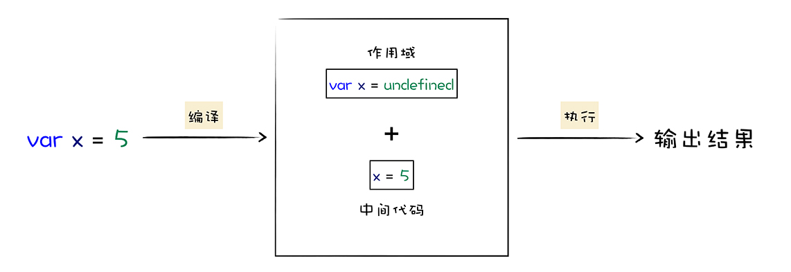
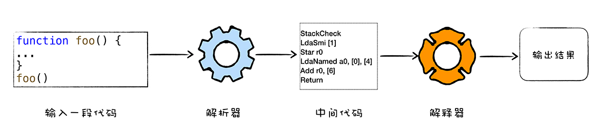
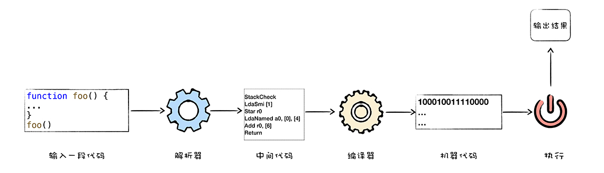
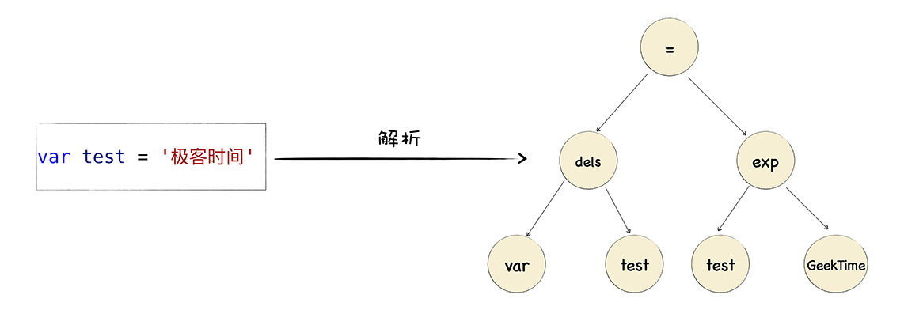

# V8执行JS代码
## 什么是V8
- 编译
- 执行  

> 将JS代码转换为低级中间代码或机器能够理解的机器代码，然后再执行转换后的代码并输出执行结果。  



## 高级语言的代码执行
1. **解释执行**，先将输入的代码通过解析器编译还曾中间代码，之后直接用解释器解释执行中间代码。  

  

2. **编译执行**，先将输入的代码通过解析器编译还曾中间代码，然后编译器将中间代码编译成机器代码(二进制文件)，再执行输出结果。  

   

## V8执行JS代码
V8混合编译执行和解释执行这两种手段，即**JIT(Just In Time)技术**  

    

1. 初始化基础环境
2. 解析源码生成AST和作用域
3. 依据AST和作用域生成字节码
4. 解析执行字节码
5. 监听热点代码
6. 优化热点代码为二进制的机器代码
7. 反优化生成二进制机器代码

### 准备基础环境
- JS全局执行上下文，包含了执行过程中的全局信息，比如一些内置函数，全局变量等信息。
- 全局作用域包含了一些全局变量，在执行过程中的数据需要存放在内存中
- V8采用堆和栈的管理内存管理模式，需要初始化堆栈结构
- 需要初始化消息循环系统，包含了消息驱动器和消息队列，不断接受消息并决策如何处理消息。  

### 结构化JS源代码
- 源代码结构化后生成**抽象语法树(AST)**
- 生成相关作用域，在作用域中存放相关变量

### 生成字节码
- 字节码是介于AST和机器代码的中间代码  

> 解释器可以直接解释执行字节码，或者通过编译器将其编译为二进制的机器代码再执行  

### 解释器解释执行字节码，输出结果
> 监控解释器执行状态，如果发现某一段代码会被重复多次执行，那么监控机器人会将这段代码标记为**热点代码**  

> 当某段代码被标记为热点代码后，V8就会将这段字节码丢给**优化编辑器**，优化编辑器会在后台将字节码编译为**二进制代码**，然后再对编译后的二进制代码执行优化操作，优化后的二进制机器代码的执行效率会大幅提高。下次再执行时，V8会优先选择该二进制代码，使得执行速度提高。   

### 反优化代码
经过反优化代码，下次执行时就会回退到解释器解释执行。(指针代码对象的结构被动态修改)


## 追踪一段实际代码的执行流程
- AST树  


  

- 作用域   

```

Global scope:
global { // (0x7fd974022048) (0, 24)
  // will be compiled
  // 1 stack slots
  // temporary vars:
  TEMPORARY .result;  // (0x7fd9740223c8) local[0]
  // local vars:
  VAR test;  // (0x7fd974022298)
}
```
