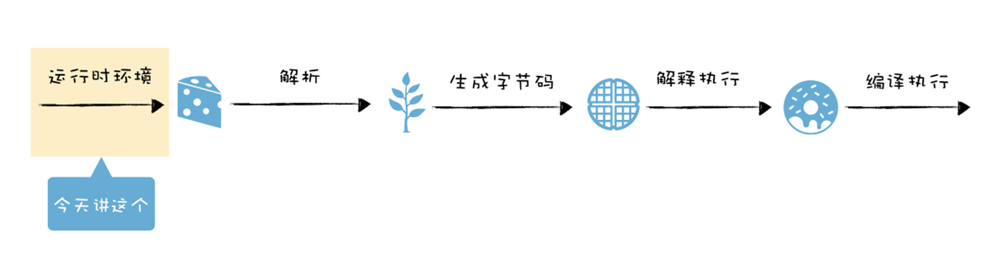
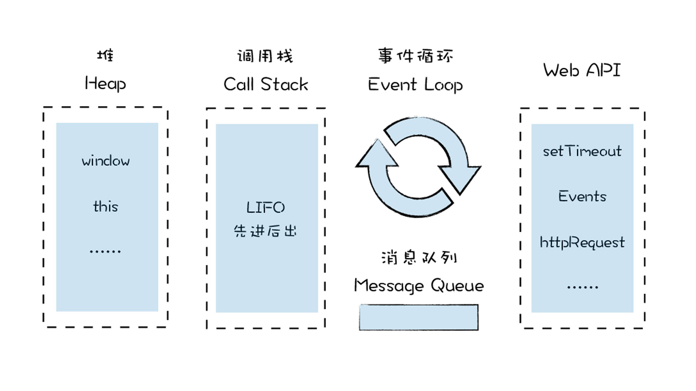
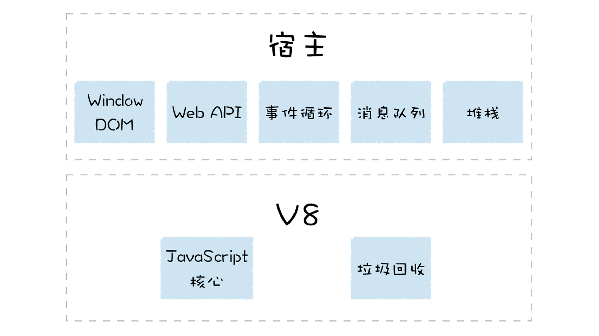
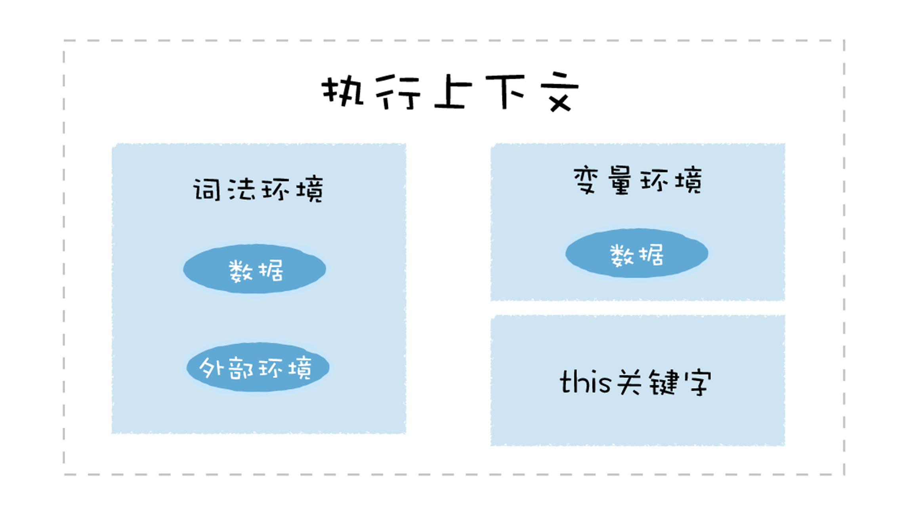
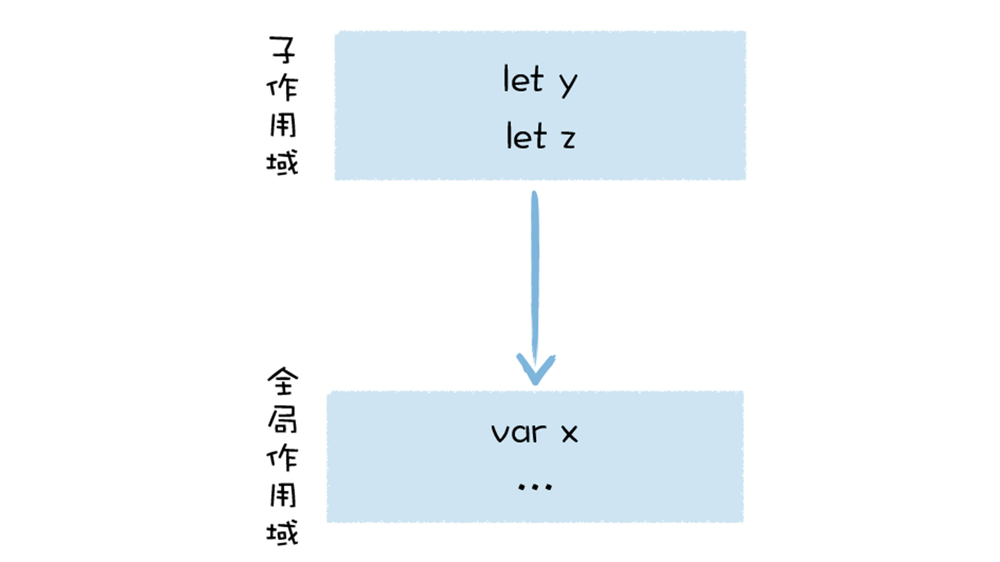
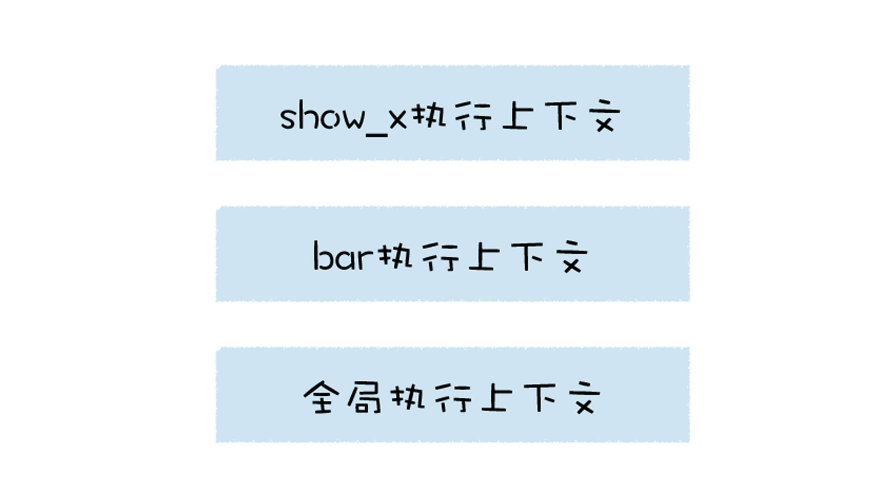

# 运行时环境：运行JS代码的基石
  

  

**运行时环境**  

- 堆空间
- 栈空间
- 全局执行上下文
- 全局作用域
- 内置的内建函数
- 宿主环境提供的扩展函数和对象
- 消息循环系统

## V8的宿主环境
  

### 构造数据存储空间：堆空间和栈空间
> 宿主在启动V8的过程中，会同时创建堆空间和栈空间，再继续往下执行，产生的新数据都会存放在这两个空间中。  

- 栈空间：主要用来管理JS函数调用，内存中**连续**的一块空间，**先进后出**。  

在函数调用过程中，涉及到**上下文相关**的内容都会存放在栈上，比如原生类型、引用到的对象的地址、函数的执行状态、this值等都会存在在栈上。当一个函数执行结束，该函数的执行上下文便会被销毁掉。  

空间连续，所以栈中每个元素的地址都是固定的，因此**查询效率高**。但内存中很难分配到这么大的连续空间，所以对栈空间做了限制，如果函数调用层过深，V8会抛出**栈溢出的错误**

```

function factorial(n){
  if(n === 1) {return 1;}
    return n*factorial(n-1);
}
console.log(factorial(50000))

//VM68:1 Uncaught RangeError: Maximum call stack size exceeded
```

- 堆空间：树形的存储结构，用来存储对象类型的离散数据。  

JS中除了原生类型的数据，其他的都是对象类型(函数、数组、浏览器中的window对象、document对象等)，都存在堆空间。

### 全局执行上下文和全局作用域  

> V8初始化基础的存储空间后，初始化全局执行上下文和全局作用域  

- 执行上下文  
  - 变量环境
  - 词法环境
  - this关键字  

浏览器环境中全局执行上下文包括了window对象、默认指向window的this关键字、Web API函数。  
词法环境中包含使用let、const等变量的内容  

  

> 全局执行上下文在v8的生存周期内不会被销毁，一直保存在**堆**中，但再次使用函数或全局变量时，不需要重新创建。  

```

var x = 1
function show_x(){
    console.log(x)
}
```

#### 全局作用域和全局执行上下文的关系
> 同一个全局执行上下文中，都能存在多个作用域
```

var x = 5
{
    let y = 2
    const z = 3
}
```

  

> 当V8调用一个函数时，就会进入函数的执行上下文，这个全局执行上下文和当前的函数执行上下文就形成一个**栈结构**  

```

var x = 1
function show_x(){
    console.log(x)
}
function bar(){
  show_x（）
}
bar()
```



### 构造事件循环系统

> V8使用宿主提供的**主线程**来**执行JS代码**和执行**垃圾回收**等工作。

只有一个主线程依然不行，如果只有一个线程，执行完一段代码后，自动退出，执行过程中栈上的数据也随之销毁，下次执行时，需要重启个线程和初始化数据，影响到程序执行性能。  

为了在执行完代码后，让线程继续运行，通常的做法是在代码中添加一个循环语句，在循环语句中监听下个事件，比如你要执行另外一个语句，那么激活该循环就可以执行了。

```

while(1){
  Task task = GetNewTask()；
  RunTask(task)；
}
```

如果主线程正在执行一个任务，又来一个新任务，比如V8正在操作DOM,浏览器网络线程完成一个页面下载的任务，V8注册监听下载完成的事件，这时需要引入一个**消息队列**，让下载完成的事件暂存到消息队列中，等当前的任务执行结束后，再从消息队列中取出正在排队的任务。当执行完一个任务后，**事件循环系统**会重复这个过程，继续在消息队列中取出并执行下个任务。  

> 因为所有的任务都运行在主线程，在浏览器的页面中，V8会和页面共用主线程，共用消息队列，所有如果V8执行一个函数过久，会影响到浏览器页面的交互性能。