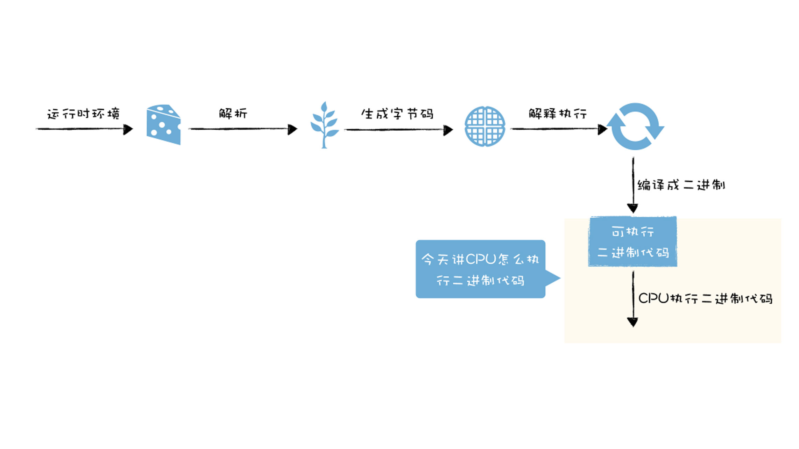
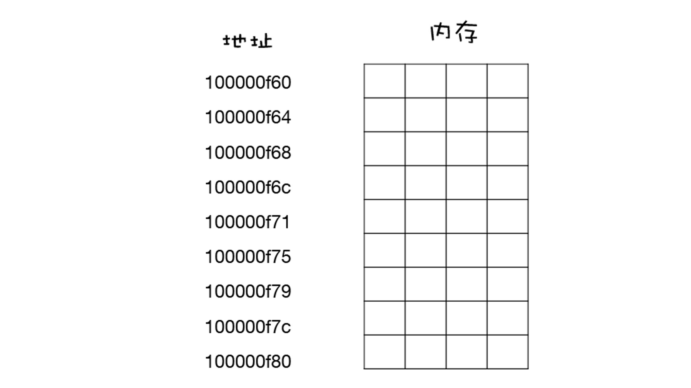
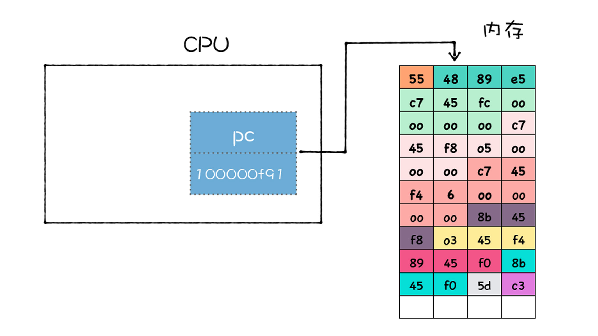
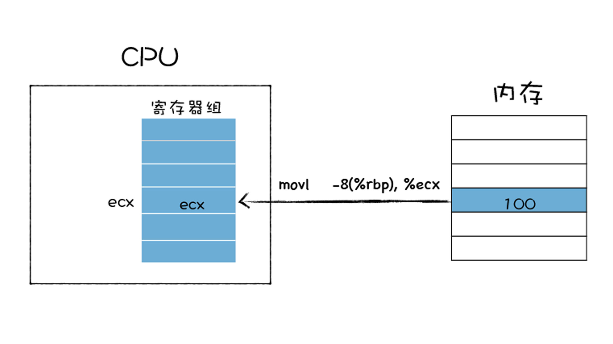
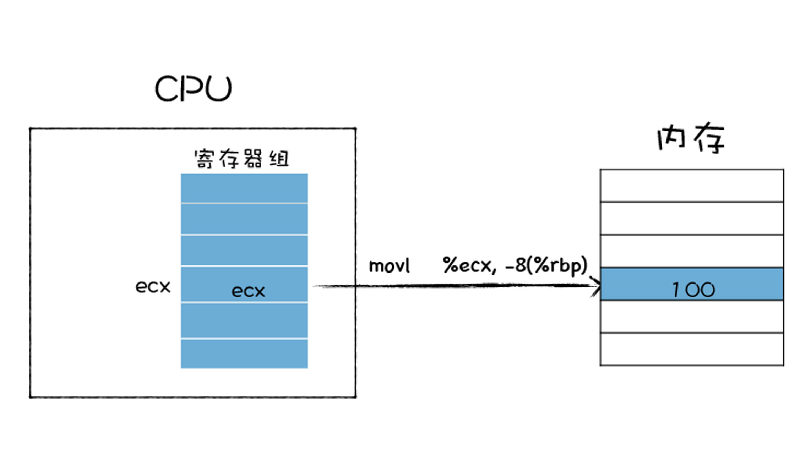
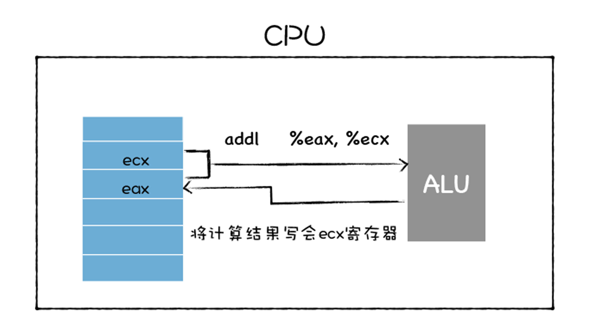
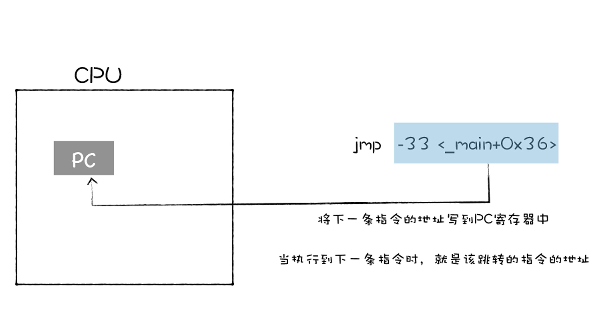

# 机器代码：二进制机器码如何被CPU执行
> V8需要先将JS编译成字节码或二进制代码，再执行  

## CPU执行程序
  

1. 在程序执行前，将程序装入内存
2. CPU通过指定内存地址，从内存中读存数据
3. 内存中的每个存储空间都有其对应的独一无二的地址  

  

4. 一旦二进制代码被装载进内存，CPU便可以从内存中**取出指令**，**分析指令**，最后**执行指令**(一个CPU时钟周期)

### PC寄存器
   

> CPU中的PC寄存器，保存了将要执行的指令地址，当二进制代码被装载进内存后，系统会将二进制代码中的第一条指令的地址写入到PC寄存器中，到了下一个时钟周期时，CPU便会根据PC寄存器中的地址，从内存中取出指令。  

取出指令后：  
- 将下一条指令的地址更新到PC寄存器中  

  

- 分析该指令

### 通用寄存器
> 通用寄存器是CPU中用来存放数据的设备，通常用来存放数据或内存中某块数据的地址(指针)  

- 通用寄存器容量小，读写速度快
- 内存容量大，读写速度慢

### 指令类型
1. 加载的指令：从内存中复制指定长度的内容到通用寄存器中，并覆盖寄存器中原来的内容  

2. 存储的指令：将寄存器中的内容复制到内存某个位置，并覆盖掉内存中的这个位置上原来的内容  

3. 更新指令：复制两个寄存器(或寄存器和内存)的内容到ALU,ALU将两个字相加，将结果放到其中一个寄存器中，将原本的内容覆盖  

4. 跳转指令：从指令本身抽取一个字，这个字是下一条要执行的指令的地址，并将该字复制到PC寄存器中，并覆盖掉PC寄存器中原来的值。  

