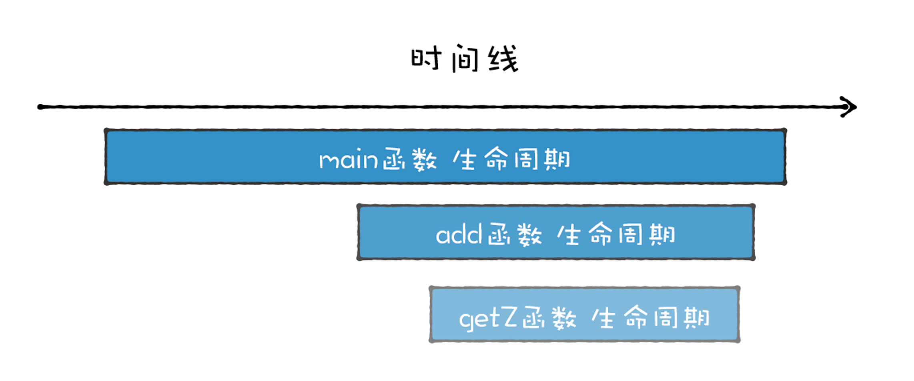

# 堆和栈：函数调用如何影响到内存布局
```
function foo(){
    foo();
}

foo();

//同一个任务中重复调用嵌套的foo函数
//造成栈溢出
```

```
function foo(){
    setTimeout(foo,0);
}

//使用setTimeout让foo函数在不同的任务中执行
//不会影响到当前的栈结构
//能够正确执行
```

```
function foo(){
    return Promise.resolve().then(foo);
}

foo()

//在同一个任务中执行foo函数，但不是嵌套执行
//没有栈溢出的错误，却造成页面卡死
```

V8执行这三种代码时，**内存布局**不同，影响到了代码的执行逻辑


## 为什么使用栈结构来管理函数调用
**后进先出(LIFO)**  


### 函数的特征
1. 函数可以被调用

> 可以在一个函数中调用另外一个函数，当函数调用发生时，执行代码的控制权将从父函数转移到子函数，子函数执行结束后，又会将代码执行控制权返回父函数。  


2. 具有作用域机制  

> 函数在执行时可以将定义在函数内部的变量和外部环境隔离，在函数内部定义的变量称为**临时变量**，临时变量只能在该函数中被访问，外部函数通常无权访问，当函数执行结束后，存放在内存中的临时变量也随之被销毁  

```

int getZ()
{
    return 4;
}
int add(int x, int y)
{
    int z = getZ();
    return x + y + z;
}
int main()
{
    int x = 5;
    int y = 6;
    int ret = add(x, y);
}
```

   

**函数调用者的生命周期总是长于被调用者(后进)，并且被调用者的生命周期总是先于调用者的生命周期结束(先出)**   



作用域机制中，**站在函数资源分配和回收角度来看，被调用函数的资源分配总是晚于调用函数(后进)，而函数资源的释放则总是先于调用函数(先出)**  


## 栈如何管理函数调用
1. 函数在执行过程中，其内部的临时变量会按照执行顺序被压入到栈中  


函数的嵌套使用时
```

int add(num1,num2){
    int x = num1;
    int y = num2;
    int ret = x + y;
    return ret;
}


int main()
{
    int x = 5;
    int y = 6;
    x = 100;
    int z = add(x+y);
    return z;
}
```

  

  

**恢复现场**：当add函数执行结束后，要将执行代码的控制权交回main函数，即将栈的状态恢复到main函数上次执行时的状态

> 在**寄存器**中保存一个永远**指向当前栈顶的指针**，让你知道在哪添加新元素，该指针通常存放在**esp寄存器**。    
> 如果想往栈中添加一个元素，需要先根据esp寄存器找到当前栈顶位置，添加新元素后，将新元素的地址更新到esp寄存器中。  

- add函数即将结束的状态 

  

- 恢复mian函数执行现场，CPU中esp将指针向下移动到之前main函数的执行位置  

  

- 在main函数调用add函数时，CPU会将当前main函数的栈顶指针保存在栈中(**栈帧指针**)。

**ebp寄存器**中保存的就是当前函数的栈帧指针
 
销毁add函数后，取出栈顶指针，写入esp中即可  

  

main函数调用add函数时，CPU会将当前函数的栈帧指针保存在栈中。  

当函数调用结束后，需要恢复main函数的执行现场，首先取出ebp中的指针，写入esp，然后从栈中取出之前保留的main的栈帧地址，将其写入ebp中，到这里ebp和esp就都恢复了，可以继续执行main函数了。  


## 有了栈，为什么还要堆
栈的优势：  
1. 栈的结构非常适合函数调用过程
2. 在栈上分配资源和销毁资源的速度非常快，这主要归结于栈空间是连续的，分配空间和销毁空间只需要移动下指针就可以了。

缺陷：  
1. 栈的连续性，导致在内存中很难找到那么大的一块空间
2. 栈的有限性,导致栈溢出

### 堆，保存大数据
不要求连续存放，从堆上分配内存快没有固定模式，可以在任何适合分配和释放  

```

struct Point
{
    int x;
    int y;
};


int main()
{
    int x = 5;
    int y = 6;
    int *z = new int;
    *z = 20;


    Point p;
    p.x = 100;
    p.y = 200;


    Point *pp = new Point();
    pp->y = 400;
    pp->x = 500;
    delete z;
    delete pp;
    return 0;
```


