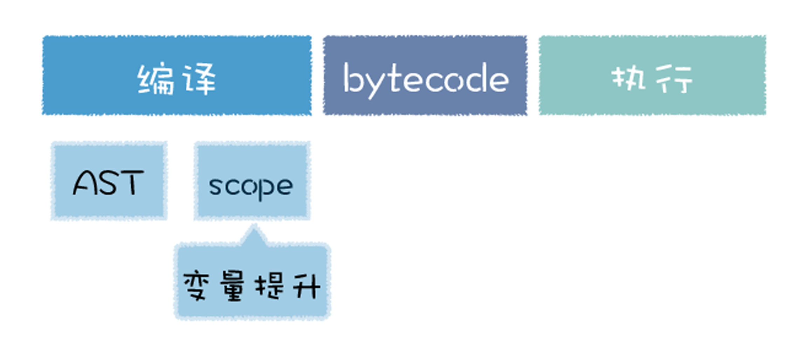
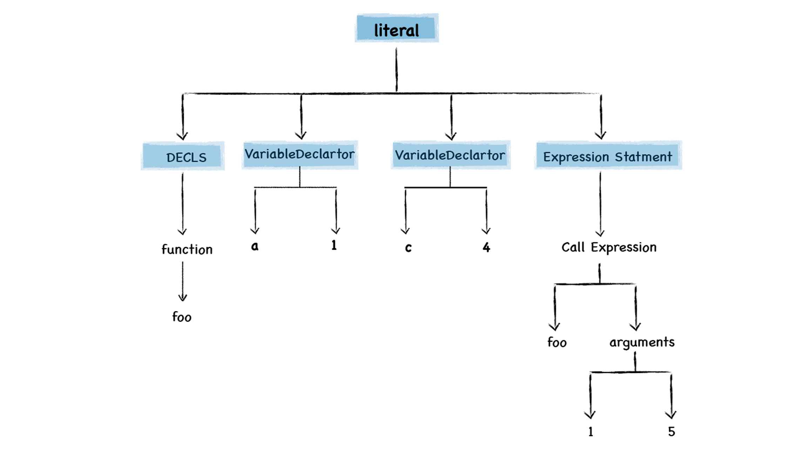

# 延迟解析：V8是如何实现闭包的
V8执行代码：  
- 编译：将JS代码转换为字节码或二进制机器代码
- 执行：解释器解释执行字节码、或CPU直接执行二进制机器码   

  

编译过程不会一次性将JS解析为中间代码：  

- 过多代码会增加编译时间，影响首次执行速度
- 一次执行后的中间代码和机器代码会一直占用内存  

所以JS虚拟机实行**惰性解析**：解析器在解析过程中，如果遇到函数声明，会跳过函数内部的代码，不会为其生成AST和字节码，而仅仅生成顶层代码的AST和字节码

## 惰性解析的过程
```

function foo(a,b) {
    var d = 100
    var f = 10
    return d + f + a + b;
}
var a = 1
var c = 4
foo(1, 5)
```
顶层代码中将函数声明转换为**函数对象**  



## 解析闭包--JS的三个特性
### 1.JS语言允许在函数内部定义新的函数
```

function foo() {
    function inner() {
    }
    inner()
}
```
主要是因为JS中的函数即对象

### 2.可以在内部函数中访问父函数中定义的变量
```

var d = 20
//inner函数的父函数，词法作用域
function foo() {
    var d = 55
    //foo的内部函数
    function inner() {
      return d+2
    }
    inner()
}
```
父子关系是针对**词法作用域**而言的，因为词法作用域在函数声明时就决定了。   

> 每个函数都有自己的词法作用域，该函数中定义的变量都存在于该作用域中，然后V8会将这些作用域按照词法的位置，也就是代码位置关系，将这些作用域串成一个链，这就是**词法作用域链**，查找变量的时候会沿着词法作用域链的途径来查找。

### 3.因为函数是一等公民，所以函数可以作为返回值
```

function foo() {
    return function inner(a, b) {
        const c = a + b 
        return c
    }
}
const f = foo()
```

## 闭包给惰性解析带来的问题
```

function foo() {
    var d = 20
    return function inner(a, b) {
        const c = a + b + d
        return c
    }
}
const f = foo()
```
在执行foo函数的阶段，采取了惰性解析，不会解析和执行foo函数中的inner函数，但是V8还是需要判断inner函数是否引用了foo函数中的变量，负责处理这个任务的模块叫做**预解析器**

## 预解析器如何解决闭包所带来的问题
V8引入预解析器，比如当解析顶层代码的时候，遇到一个函数，那么预解析器并不会直接跳过该函数，而是对该函数做一次快速的预解析。  

- 1.判断当前函数是不是存在一些语法上的错误
- 2.检查函数内部是否引入了外部变量，如果有，预解析器会将栈中的变量**复制到堆**中，在下次执行到该函数的时候，直接使用堆中的引用