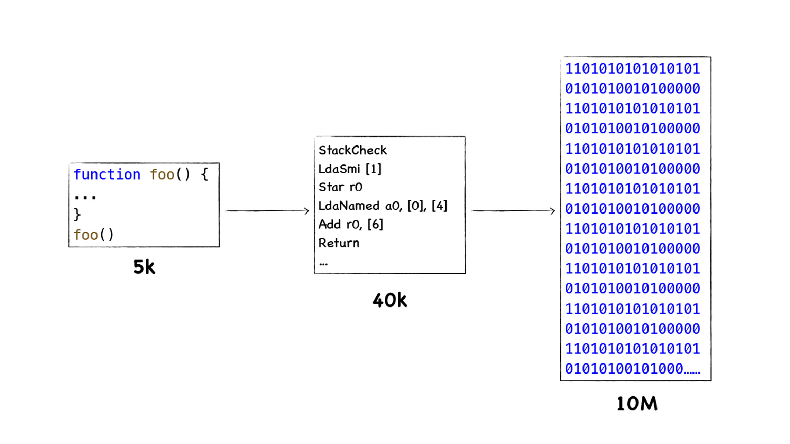
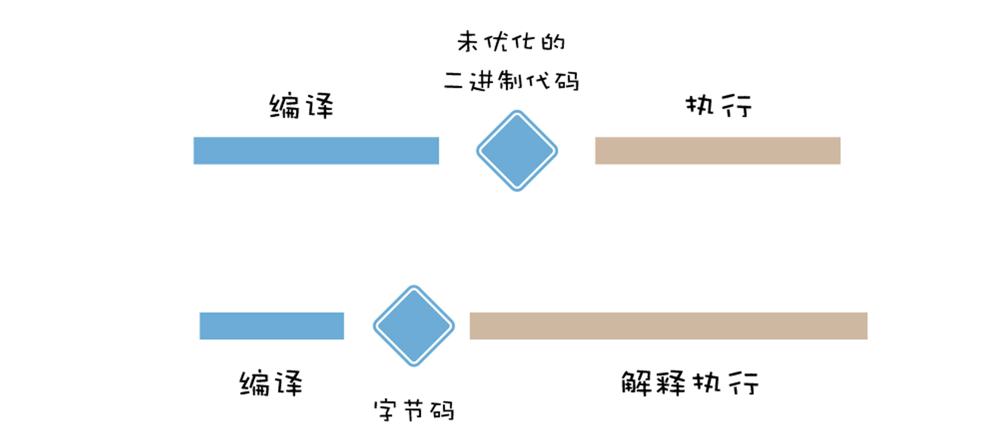

# 字节码一：V8为什么又重新引入字节码
> V8在执行一段JS代码之前，需要将其编译为字节码，然后再解释执行字节码或将字节码编译为二进制代码然后再执行。   

字节码：编译过程中的中间代码。在V8中，字节码有两个作用：  
- 解释器可以直接解释执行字节码
- 优化编译器可以将字节码编译为二进制代码，然后再执行二进制机器代码  

## 早期V8执行流水线
  

1. **基线编译器**：将JS代码编译为**没有优化**过的机器代码
2. **优化编译器**：将一些热点代码(执行频繁的代码)优化为执行效率更高的机器代码  

### 早期V8执行JS代码的流程
1. 将JS代码转换为**抽象语法树(AST)**
2. 基线编译器会将抽象语法树编译为未优化过的机器代码，然后V8直接执行这些未优化过的机器代码
3. 在执行未优化的二进制代码过程中，如果V8检测到某段代码重复执行的概率过高，那么V8会将该段代码标记为HOT,标记为HOT的代码会被优化编译器优化为执行效率高的二进制代码，然后就执行该段执行过的二进制代码
4. 如果优化过的二进制代码并不能满足当前代码的执行，这就意味着优化失败，V8则会执行反优化操作

## 机器代码缓存
  

未优化时，编译所消耗的时间和执行差不多  

Chrome浏览器引入二进制代码缓存：通过把二进制代码保存在内存中来消除冗余的编译，重用他们完成后续的调用，省去再次编译的时间   

### 代码缓存策略

## 字节码降低了内存占用
    

采用字节码可以明显降低缓存中所需的内容容量

## 字节码如何提高代码启动速度

解释器生成字节码的速度较快，减少了编译所需时间

## 字节码如何减低代码的复杂度
  

因为字节码的执行过程和CPU执行二进制代码的过程类似，相似的执行流程，那么字节码转换为不同架构的二进制代码的工作量也会大大降低，这就减低了转换底层代码的工作量。