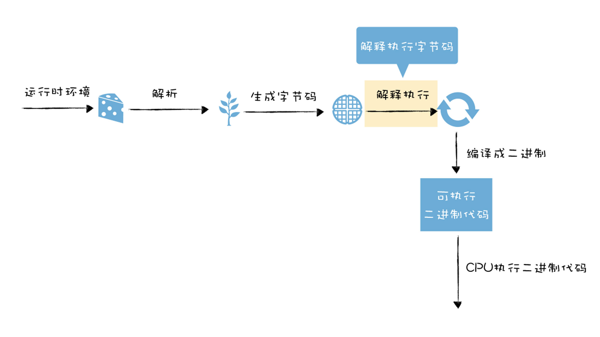
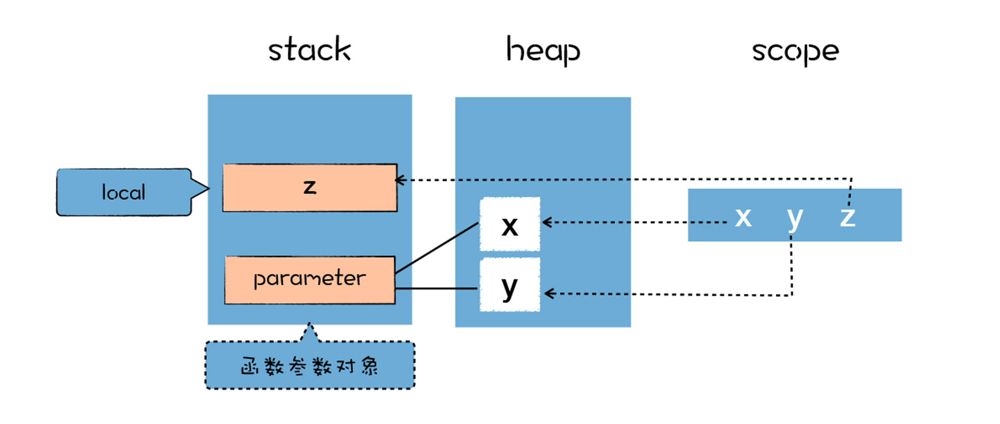

# 字节码：解释器是如何解释执行字节码
  

## 如何生成字节码
> V8执行一段JS代码时，会先对JS代码进行解析(Parser)，生成AST和作用域消息，这些被输入到Ignition解释器中，将其转化为字节码，之后字节码再由Ignition解释器来解释执行。  

```

function add(x, y) {
  var z = x+y
  return z
}
console.log(add(1, 2))
```

作用域中的变量都是未使用的，默认值都是undefined,在执行阶段，作用域中的变量会指向堆和栈中相应的数据。  

  

AST会被作为输入传入字节码生成器(BytecodeGenerator),这是Ignition解释器中的一部分，用于生成以函数为单位的字节码。

