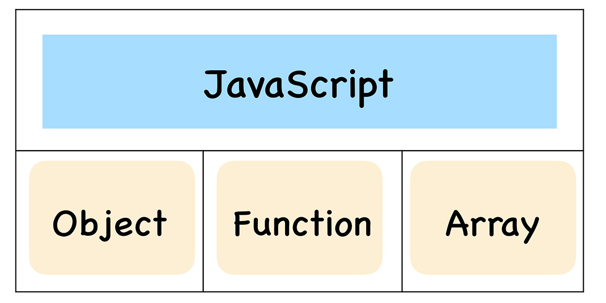
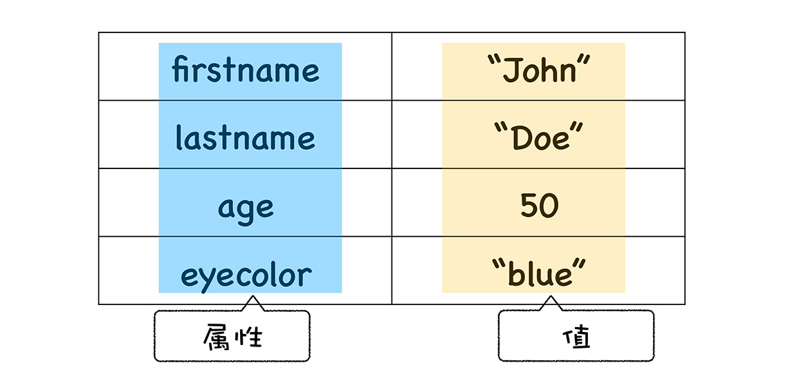
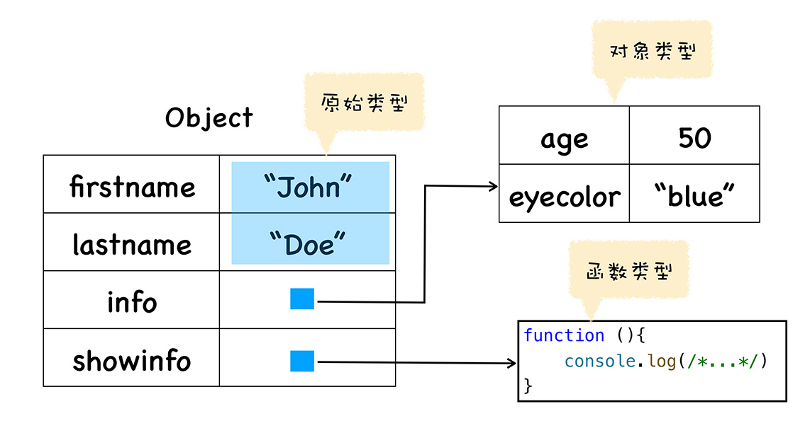

# 函数即对象
## 什么是JS中的对象
  

> 只是在对象中添加一个称为原型的属性，把继承的对象通过原型链接起来，就实现了继承，我们把这种继承方式称为**原型链继承**  

- JS中的对象就是由一组组属性和值构成的集合  

```

var person=new Object();
person.firstname="John";
person.lastname="Doe";
person.age=50;
person.eyecolor="blue";
```

  

- 对象的值可以是任意类型的数据

```

var person=new Object()
person.firstname="John"
person.lastname="Doe"
person.info = new Object()
person.info.age=50
person.info.eyecolor="blue"
person.showinfo = function (){
    console.log(/*...*/)
}
```



## 函数的本质
- 函数和普通对象不同的是，函数可以被调用

### V8内部怎么实现函数可调用特性
  

v8为函数对象添加了两个隐藏属性  

- name属性：函数名称
- code属性：函数代码(字符串形式)  

```

(function (){
    var test = 1
    console.log(test)
})()
```
如果没有设置函数名，则name属性为anonymous，表示函数对象没有被设置名称  

## 函数是一等公民
**如果某个编程语言的函数可以和它的数据类型做一样的事情，我们就把这个语言中的函数称为一等公民**  

- 函数作为一个对象，它有自己的属性和值，所以函数关联了基础的属性和值
- 函数之所以成为特殊的对象，这个特殊的地方是函数可以“被调用”，所以一个函数被调用时，它还需要关联相关的执行上下文