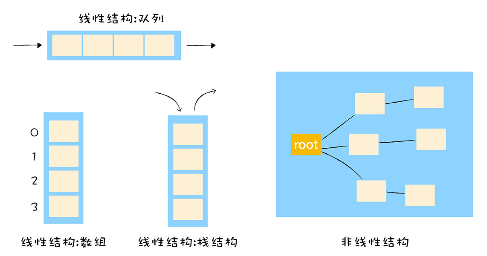

# 快属性和慢属性：V8采用了哪些策略提升了对象属性的访问速度
> V8在实现对象存储时，出于性能考虑，没有采用字典的存储方式。因为字典是非线性的数据结构，查询效率会低于线性的数据结构，v8为了提升存储和查询效率，采用了一套复杂的存储策略。  

  

## 常规属性(properties)和排序属性(element)  

```

function Foo() {
    this[100] = 'test-100'
    this[1] = 'test-1'
    this["B"] = 'bar-B'
    this[50] = 'test-50'
    this[9] =  'test-9'
    this[8] = 'test-8'
    this[3] = 'test-3'
    this[5] = 'test-5'
    this["A"] = 'bar-A'
    this["C"] = 'bar-C'
}
var bar = new Foo()


for(key in bar){
    console.log(`index:${key}  value:${bar[key]}`)
}
```

```

index:1  value:test-1
index:3  value:test-3
index:5  value:test-5
index:8  value:test-8
index:9  value:test-9
index:50  value:test-50
index:100  value:test-100
index:B  value:bar-B
index:A  value:bar-A
index:C  value:bar-C
```

- 设置的数字属性被最先打印出来，按数字大小排序打印
- 字符串则按设置的顺序打印  

> 因为在ES规范中定义了**数字属性应该按照索引值大小升序排序，字符串属性根据创建时的顺序升序排序**  

- 把对象中的数字属性称为**排序属性(elements)**
- 字符串属性称为**常规属性(properties)**  

> 在V8内部，为了有效地提升存储和访问这两种属性的性能，分别使用了两个**线性数据结构**来分别保存排序属性和常规属性  

  

对象中包含两个隐藏属性：  
- elements：指向elements对象
- properties：指向properties对象  

> 分解成这两种线性数据结构后，如果执行索引操作，那么V8会先从elements属性中按照顺序读取所有的元素，然后再在properties属性中读取所有的元素，这样就完成一次索引操作。

## 快属性和慢属性
> V8采取了一个权衡的策略以加快查找属性的策略，**将部分常规属性直接存储到对象本身**，将这称为**对象内属性(in-object properties)**  

  

采用对象内属性后，使用bar.B查找B的属性值时，就不用先到properties对象中查找，节省了一个步骤，增加了查找效率  

> 将保存在**线性数据结构**中的属性称为**快属性**：通过索引即可访问到属性。但是添加或删除大量的属性时，执行效率会非常低，会产生大量时间和内存开销。  

> 如果一个对象的属性过多时，V8采用了**慢属性策略**：慢属性的对象内部会有独立的非线性数据结构(词典)作为属性存储容器  

