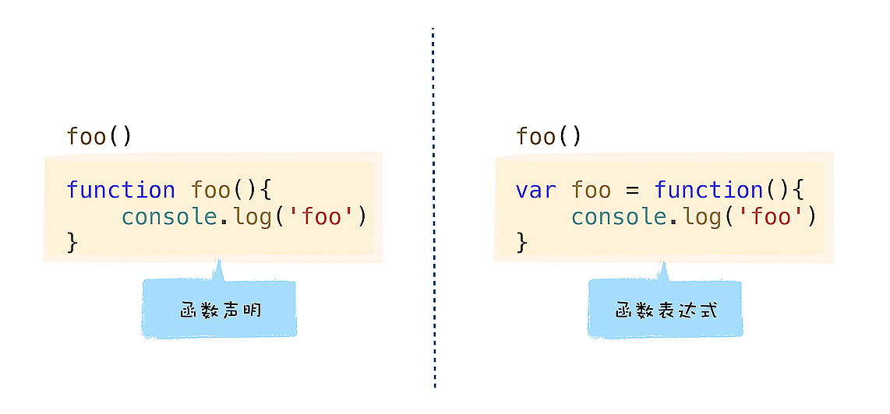

# 函数表达式


## 函数声明与函数表达式的差异
```

foo()
function foo(){
    console.log('foo')
}

//'foo'
```

```

foo()
var foo = function (){
    console.log('foo')
}

//VM130:1 Uncaught TypeError: foo is not a function
//    at <anonymous>:1:1
```


## v8是怎么处理函数声明的
> 函数声明定义了一个具有指定参数的函数

```

function name([param,[, param,[..., param]]]) {
   [statements]
}
```
### v8处理函数声明
```

var x = 5
function foo(){
    console.log('Foo')
}
```


### 编译阶段
解析函数声明：V8会将这个函数声明转换为内存中的函数对象，并将其放到作用域中。  
解析某个变量声明：将其放到作用域中，其值设置为undefined,表示该变量还未被使用

### 执行阶段
1. 去作用查询相关内容  

```

Global scope:
global { // (0x7fb62281ca48) (0, 50)
  // will be compiled
  // 1 stack slots
  // temporary vars:
  TEMPORARY .result;  // (0x7fb62281cfe8) local[0]
  // local vars:
  VAR x;  // (0x7fb62281cc98)
  VAR foo;  // (0x7fb62281cf40)


  function foo () { // (0x7fb62281cd50) (22, 50)
    // lazily parsed
    // 2 heap slots
  }
}
```
v8生成的作用域中，包含了变量x和foo,变量x的默认值是undefined,变量foo指向了foo函数对象，foo函数对象被V8存放在内存中的**堆空间**，这些变量都是在编译阶段被装进作用域中的。  

> 因为在执行之前，变量被提升到作用域中，所以在执行阶段，v8可以获取所有的定义变量。  

**变量提升**：在编译阶段，将所有的变量提升到作用域的过程。

## V8怎么处理函数表达式
```

foo = function (){
    console.log('foo')
}
```
函数表达式与函数声明的最主要区别：  
- 函数表达式是在表达式语句中使用function("a=b"这种形式)，因为函数也是一个对象，把"a=function(){}"这种方式称为函数表达式
- 在函数表达式中，可以省略函数名称，创建匿名函数(anonymous function)
- 一个函数表达式可以被用作一个即时调用的函数表达式——IIFE(Immediate Invoked Function Expression)
