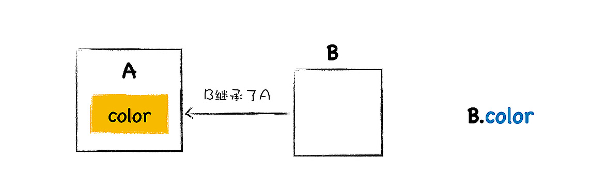
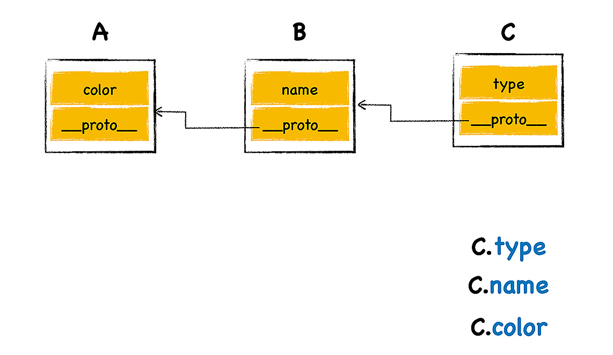
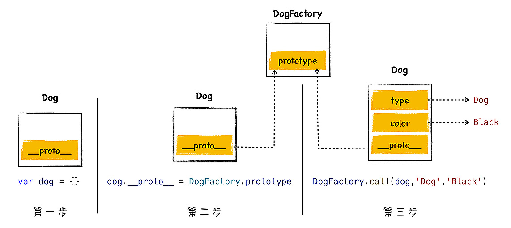
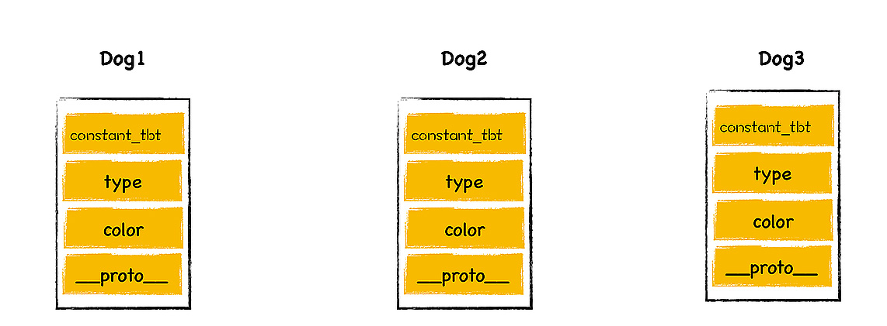
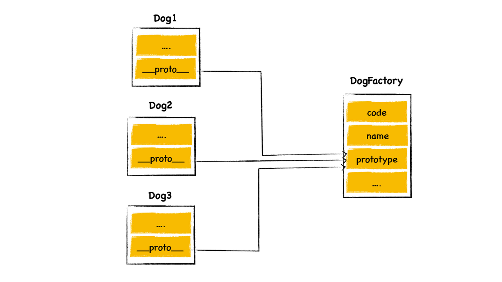

# 原型链
**继承就是一个对象可以访问另外一个对象中的属性和方法**  

   

JS仅仅在对象中引入一个原型的属性，就实现了语言的继承机制。  

## 原型继承
> JS每个对象都包含了一个隐藏属性**\_\_proto__**,称为**对象的原型(prototype)**,\_\_proto__指向了内存中的另外一个对象，把\_\_proto__指向的对象称为该对象的**原型对象**，该对象可以直接访问其原型对象的方法或属性。  

  

使用C.name和C.color时，这些属性都位于原型对象上，把这个查找属性的路径称为**原型链**。原型链是沿着对象的原型一级一级来查找属性的。  

> 继承就是一个对象可以访问另外一个对象中的属性和方法，在JS中，通过原型和原型链的方式来实现了继承特性。    

就是每个对象都有一个原型属性，该属性指向了原型对象，查找属性的时候，JS虚拟机会沿着原型一层一层向上查找，直至找到正确的属性。  

## 利用__proto__实现继承

```

var animal = {
    type: "Default",
    color: "Default",
    getInfo: function () {
        return `Type is: ${this.type}，color is ${this.color}.`
    }
}
var dog = {
    type: "Dog",
    color: "Black",
}


dog.__proto__ = animal


dog.getInfo()
```

不应该直接通过\_\_proto__来访问或者修改属性：  
- 这是隐藏属性，并不是标准定义
- 使用该属性会造成严重的性能问题  

## 构造函数是怎么创建对象的
```
//通过this设置属性值

function DogFactory(type,color){
    this.type = type
    this.color = color
}

//利用关键字“new”创建对象

var dog = new DogFactory('Dog','Black')
```
通过执行new配合一个函数，JS虚拟机会返回一个对象。  

执行以上代码时，V8会执行以下操作  

```

var dog = {}  
dog.__proto__ = DogFactory.prototype
DogFactory.call(dog,'Dog','Black')
```

  

- 1.创建一个空白对象dog
- 2.将DogFactory的prototype属性设置为dog的原型对象
- 3.再使用dog来调用DogFactory,这时候DogFactory函数中的this就指向了对象dog,然后在DogFactory函数中，利用this对对象dog执行属性填充操作，最终就创建了对象dog

## 构造函数怎么实现继承
```

function DogFactory(type,color){
    this.type = type
    this.color = color
    //Mammalia
    //恒温
    this.constant_temperature = 1
}
var dog1 = new DogFactory('Dog','Black')
var dog2 = new DogFactory('Dog','Black')
var dog3 = new DogFactory('Dog','Black')
```


### prototype
> 每个函数对象中都有一个公开的prototype属性，当你将这个函数作为构造函数来创建一个新的对象时，新创建对象的原型对象就指向了该函数的prototype属性。  

```

function DogFactory(type,color){
    this.type = type
    this.color = color
    //Mammalia
}
DogFactory. prototype.constant_temperature = 1
var dog1 = new DogFactory('Dog','Black')
var dog2 = new DogFactory('Dog','Black')
var dog3 = new DogFactory('Dog','Black')
```



