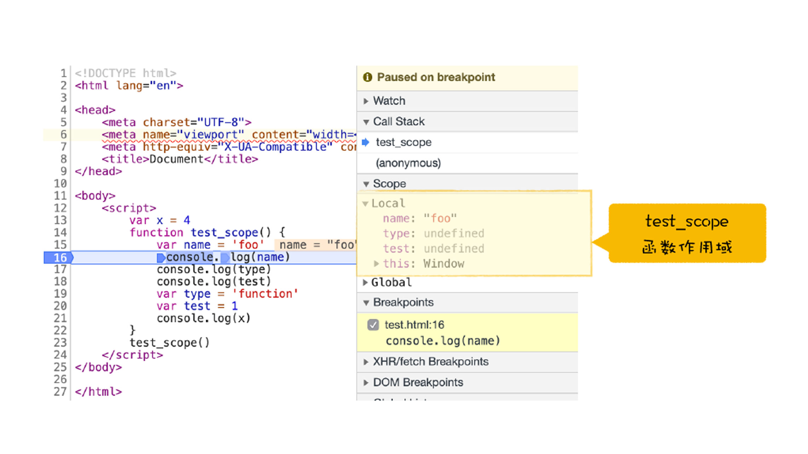
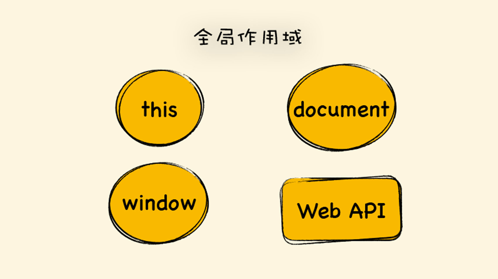
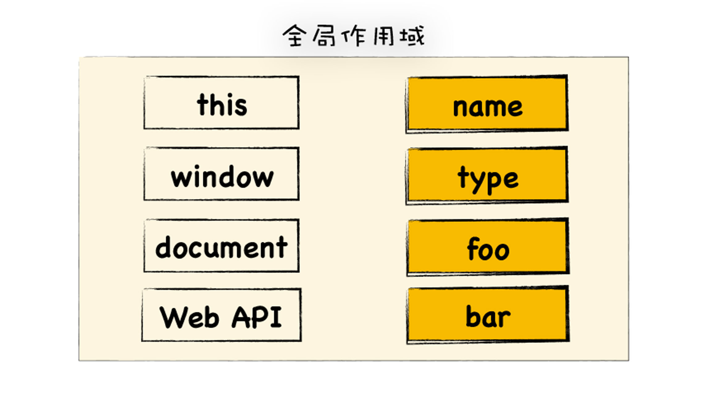
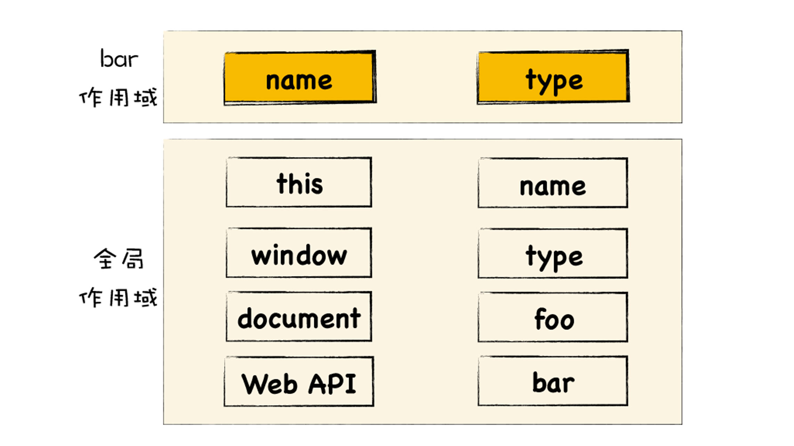
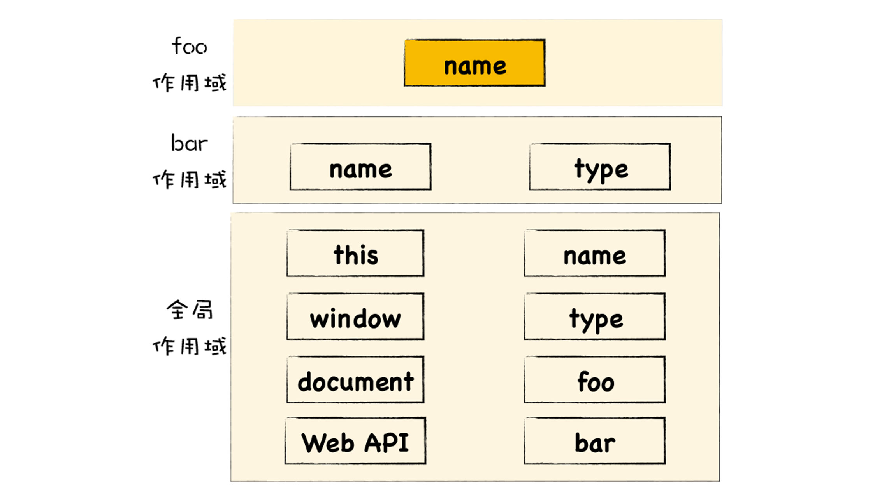
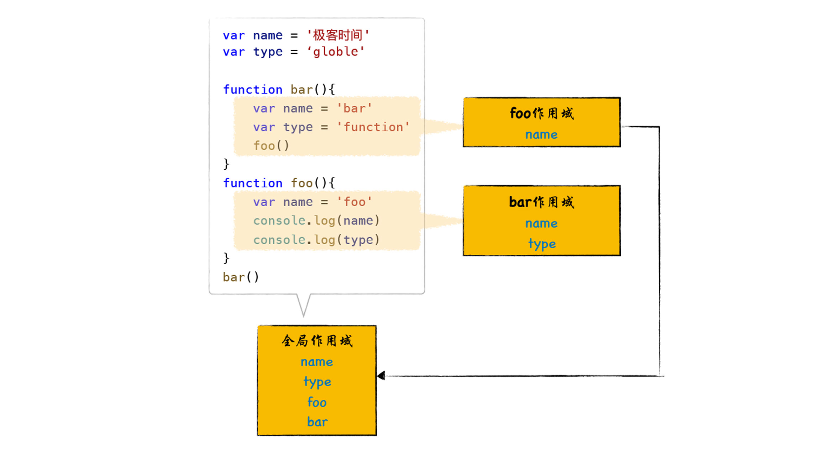

# 作用域链
> 作用域链就是将一个个作用域串起来，实现变量查找的路径。作用域就是存放变量和函数的地方。  

```

var name = '极客时间'
var type = 'globle'


function foo(){
    var name = 'foo'
    console.log(name)
    console.log(type)
}


function bar(){
    var name = 'bar'
    var type = 'function'
    foo()
}
bar()
```

## 函数作用域和全局作用域
> 每个函数在执行时都需要查找自己的作用域，我们称为函数作用域，在执行阶段，在执行一个函数时，当该函数需要使用某个变量或调用了某个函数时，便会优先在该函数作用域中查找相关内容。  

```

var x = 4
function test_scope() {
    var name = 'foo'
    console.log(name)
    console.log(type)
    console.log(test)
    var type = 'function'
    var test = 1
    console.log(x)
}
test_scope()  
```

  

> 如果在当前函数作用域中没有查找到变量，那么v8会去全局作用域中去查找，这个查找的线路就称为**作用域链**  

**全局作用域是在v8启动过程中就创建了，且一直保存在内存中不会被销毁的，直至v8退出。而函数作用域是在执行该函数时创建的，当函数执行结束之后，函数作用域就随之被销毁了.**

## 作用域链是怎么工作的
```
var name = '极客时间'
var type = 'globle'


function foo(){
    var name = 'foo'
    console.log(name)
    console.log(type)
}


function bar(){
    var name = 'bar'
    var type = 'function'
    foo()
}
bar()
```
- v8创建的全局作用域  

   

v8会先编译顶层代码,在编译过程中会将顶层定义的变量和声明的函数都添加到全局作用域中.

     

- 变量提升

```

//======解析阶段--实现变量提升=======
var name = undefined
var type = undefined
function foo(){
    var name = 'foo'
    console.log(name)
    console.log(type)
}
function bar(){
    var name = 'bar'
    var type = 'function'
    foo()
}


//====执行阶段========
name = '极客时间'
type = 'globle'
bar()
```

- 函数作用域  

  

  

> 因为JS是基于**词法作用域**,词法作用域是指,查找作用域的顺序是按照函数定义时的位置来决定的.bar和foo函数的外部代码都是全局代码,所以不管在bar函数中查找变量,还是在foo函数中,其查找顺序都是按照当前函数作用域->全局作用域这个路径来的.  

  

> 词法作用域是根据函数在代码中的位置来确定的,作用域是在声明函数时就确定好的,所以我们也将词法作用域称为静态作用域