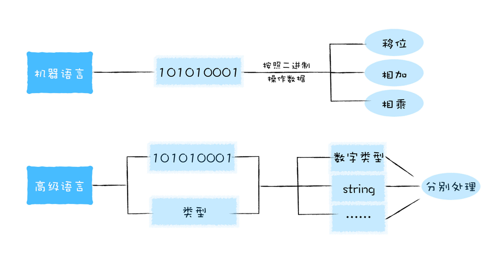
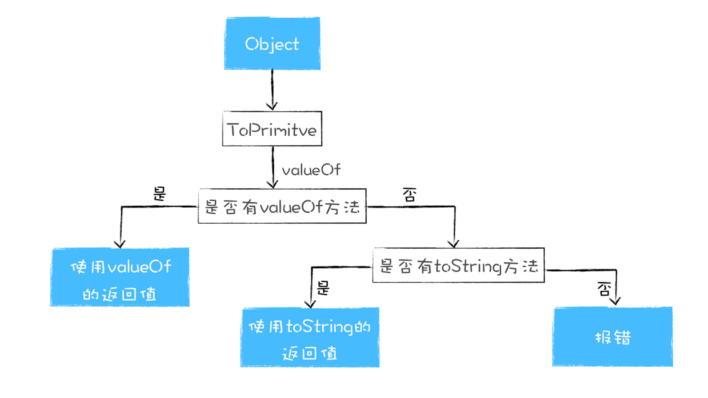

# 6.类型转换
## 什么是类型系统(Type System)
  

一门语言的类型系统定义了各种类型之间应该如何相互操作。  

## V8是怎么执行加法操作的
```
a+b
```

V8会提供一个ToPrimitive方法，将a和b转换为原生数据类型  
- 先检测该对象中是否存在valueOf方法，如果有并返回原始类型，那么就使用该值进行强行类型转换
- 如果valueOf没有返回原始类型，那么就使用toString方法的返回值
- 如果valueOf和toString两个办法都不返回基础类型值，便会触发一个TypeError的错误  

  

```
var Obj = {
    toString(){
        return '200'
    },
    valueOf(){
        return 100
    }
}

obj + 3
//103
```

```

var Obj = {
    toString() {
      return new Object()
    }, 
    valueOf() {
      return new Object()
    }   
  }
  Obj+3

//
VM263:9 Uncaught TypeError: Cannot convert object to primitive value
    at <anonymous>:9:6
```