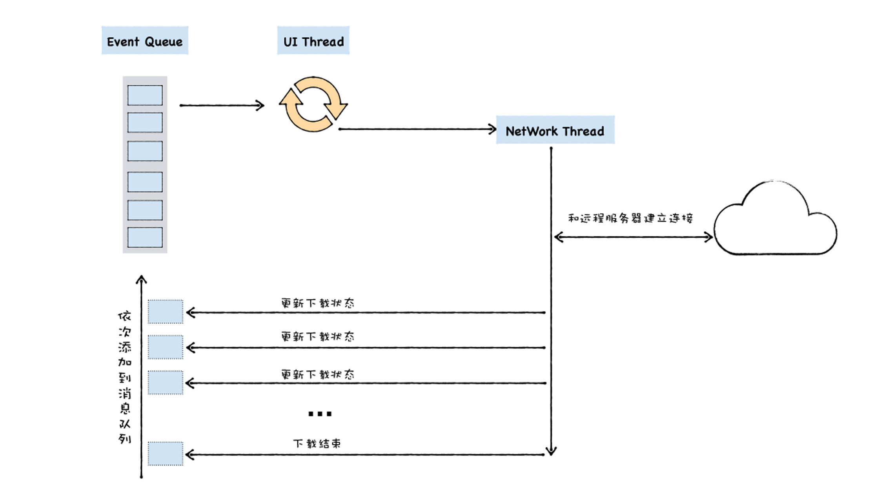

# 消息队列:V8是怎么实现回调函数的
## 什么是回调函数
> 回调函数：当某个函数作为参数，传递给另外一个函数，或者传递给宿主环境，然后该函数在函数内部或者在宿主环境中被调用。  

- 同步回调函数：在执行函数内部被执行
- 异步回调函数：在执行函数外部被执行

```
//同步回调
var myArray = ["water", "goods", "123", "like"];
function handlerArray(indexName,index){
    console.log(index + 1 + ". " + indexName); 
}
myArray.forEach(handlerArray)
```

```
//异步回调
//foo函数被V8调用
function foo() {
    alert("Hello");
}
setTimeout(foo, 3000)
```

## UI线程的宏观架构
**UI线程**：指运行窗口的线程。在页面线程中，当一个事件被触发时，比如用户使用鼠标点击页面，系统需要将该事件提交给UI线程来处理。  

为了解决**事件阻塞**的问题，UI线程提供了一个**消息队列**。  

> 将待执行的事件添加到消息队列中，然后UI线程会不断地从消息队列中取出事件、执行事件。**把UI线程每次从消息队列中取出事件，执行事件的过程称为一个任务**  

  

```

function UIMainThread() {
    while (queue.waitForMessage()) {
        Task task = queue.getNext()
        processNextMessage(task)
    }
}
```

## 异步回调函数的调用时机
- setTimeout
- XMLHttpRequest

### setTimeout
> 在setTimeout函数内部封装回调消息，并将回调函数添加进消息队列，然后主线程从消息队列中取出回调事件，并执行回调函数。

### XMLHttpRequest
> 下载过程需要单独放到一个线程中去执行，所以执行XMLHttpRequest.send的时候，宿主会将实际请求转发给网络线程，然后send函数退出，主线程继续执行下面的任务。网络线程在执行下载的过程中，会将中间消息和回调函数封装成新的消息，并将其添加进消息队列中，然后主线程从消息队列中取出回调事件，并执行回调函数。   

处理下载事件

  


异步API执行流程  

