# 异步编程：V8是如何实现微任务的
**宏任务**：指消息队列中的等待被主线程执行的事件。  

> 每个宏任务在执行时，V8都会重新创建栈，然后随着宏任务中函数调用，栈也随之变化。最终，当该宏任务执行结束时，整个栈又会被清空，接着主线程继续执行下一个宏任务  

**微任务**：一个需要异步执行的函数，执行时机是在主函数执行结束之后、当前宏任务结束之前  

> 引入微任务的原因，主要是由于主线程执行消息队列中宏任务的时间颗粒度太粗，无法胜任一些对精度和实时性要求较高的场景。  

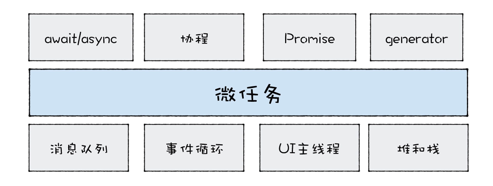  

微任务是基于消息队列、事件循环、UI主线程还有堆栈而来，然后基于微任务，衍生出协程、Promise、Generator、await/async等技术  

## 主线程、调用栈、消息队列
调用栈是一种数据结构，用来管理在主线程上执行的函数的调用关系  

```

function bar() {
}
foo(fun){
  fun()
}
foo(bar)
```  

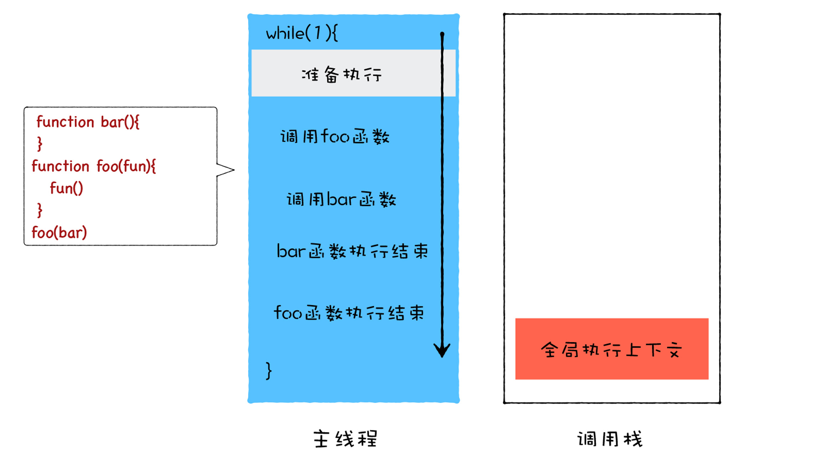  

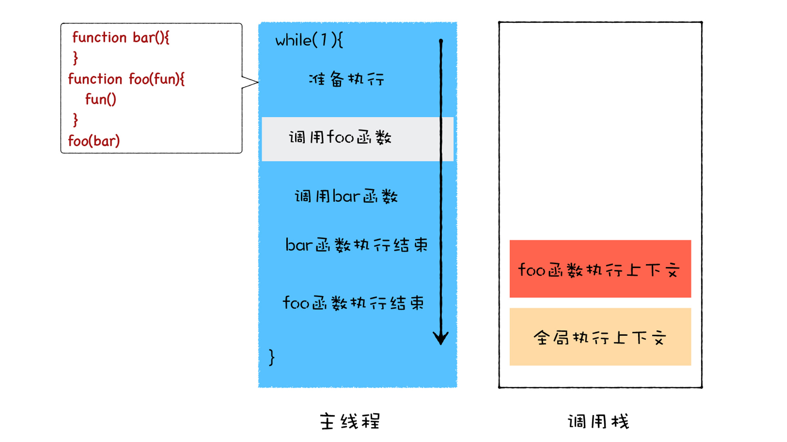  

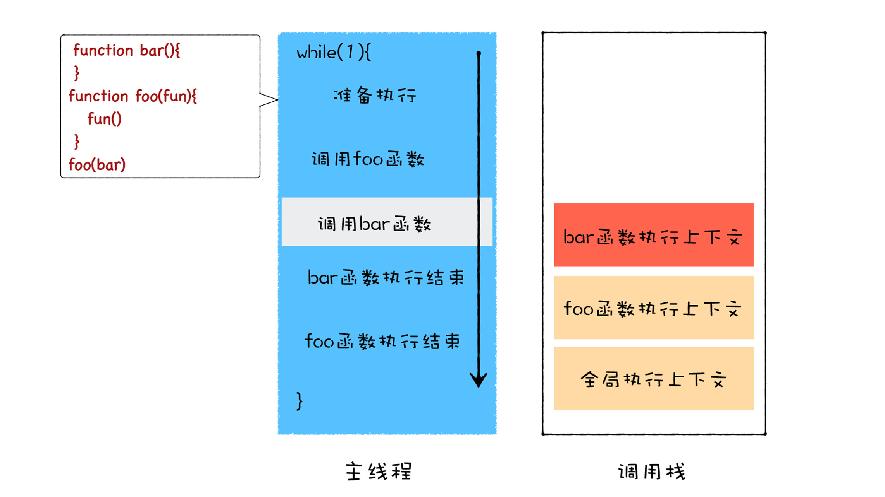  

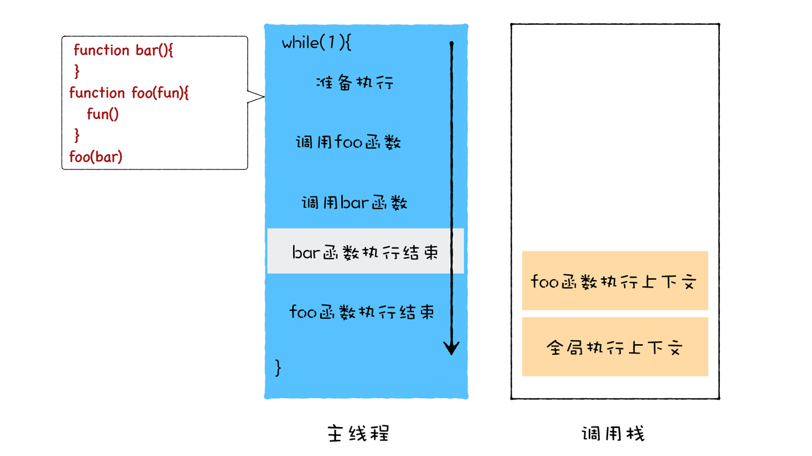  

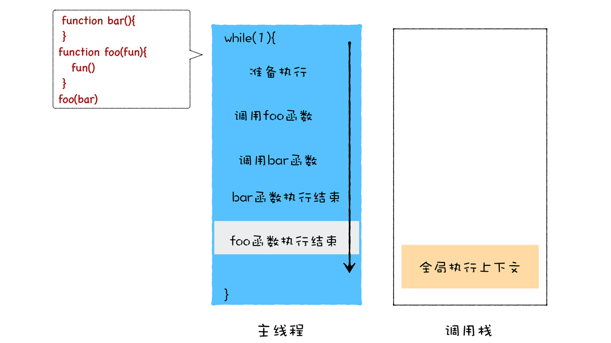

### 栈溢出问题
```

function foo(){
  foo()
}
foo()
```
由于**栈空间在内存中是连续的**，所以通常我们都会限制调用栈的大小，如果当函数嵌套层数过深时，过多的执行上下文堆积在栈中便会导致栈溢出  

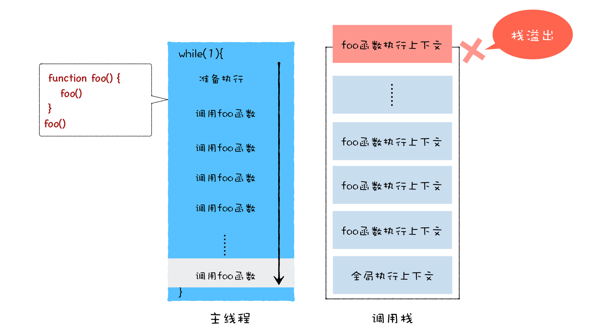

### setTimeout改造
```

function foo() {
  setTimeout(foo, 0)
}
foo()
```
**主线程会从消息队列中取出需要执行的宏任务**  

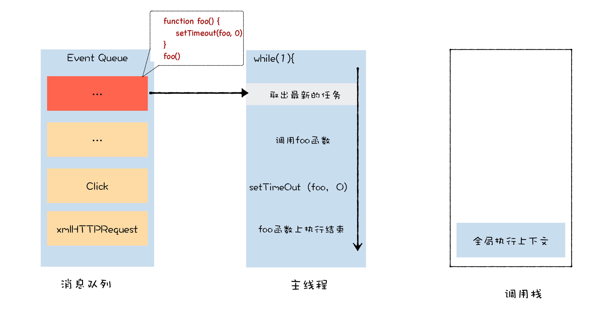  

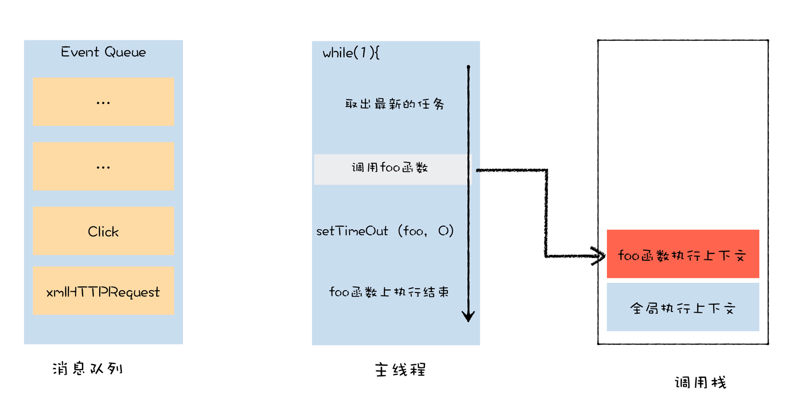  

**当V8执行foo函数中的setTimeout时，setTimeout会将foo函数封装成一个新的宏任务，并将其添加到消息队列中**  

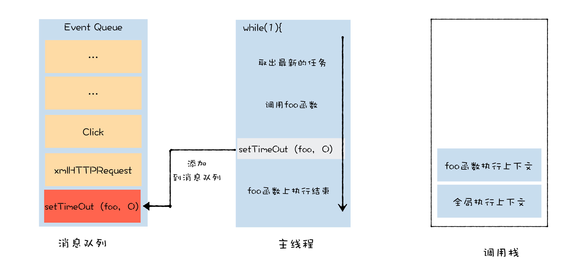   

**结束当前的宏任务后，清空调用栈**

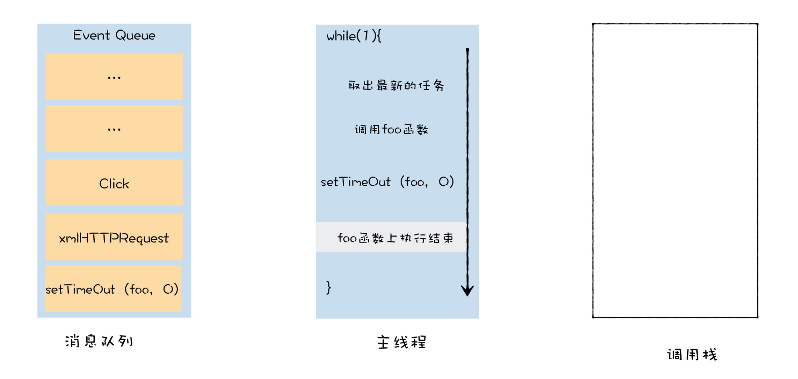    

**一个宏任务结束后，主线程会在消息队列中取出下一个宏任务执行**

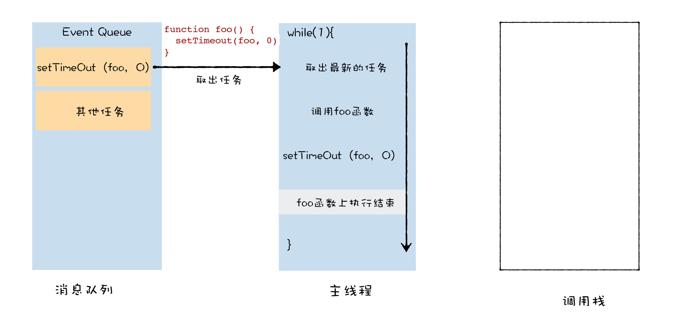  

## 微任务解决了宏任务执行时机不可控的问题
微任务会在当前的任务快要执行结束时执行，利用微任务，能比较精确地控制你的回调函数的执行时机  

> V8会为每个宏任务维护一个**微任务队列**。当V8执行一段JS时，会为这段代码创建一个**环境对象**，微任务队列就是存放在该环境对象中的。当你通过Promise.resolve生成一个微任务，该微任务会被V8自动添加进微任务队列中，等整段代码快要执行结束时，该环境对象也随之被销毁，但是在销毁之前，V8会先处理微任务队列中的微任务。  

微任务的执行时机  

- 如果当前的任务中产生一个微任务，通过Promise.resolve()或Promise.reject()都会触发微任务，触发的微任务不会在当前的函数中被执行，所以执行微任务时，不会导致栈的无限扩张
- 和异步调用不同，微任务依然会在当前任务执行结束之前被执行，即在当前微任务执行结束之前，消息队列中的其他任务是不可能被执行的  

```

function bar(){
  console.log('bar')
  Promise.resolve().then(
    (str) =>console.log('micro-bar')
  ) 
  setTimeout((str) =>console.log('macro-bar'),0)
}


function foo() {
  console.log('foo')
  Promise.resolve().then(
    (str) =>console.log('micro-foo')
  ) 
  setTimeout((str) =>console.log('macro-foo'),0)
  
  bar()
}
foo()
console.log('global')
Promise.resolve().then(
  (str) =>console.log('micro-global')
) 
setTimeout((str) =>console.log('macro-global'),0)
```

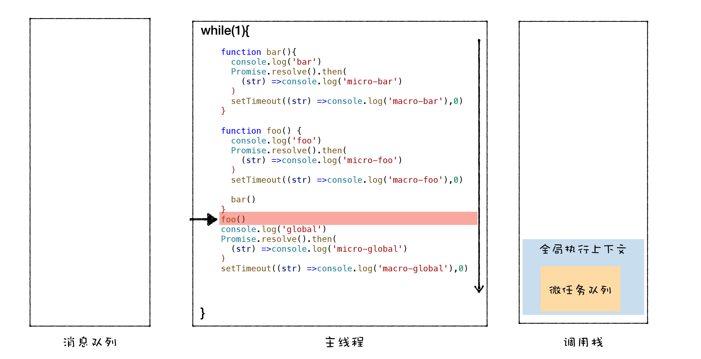  

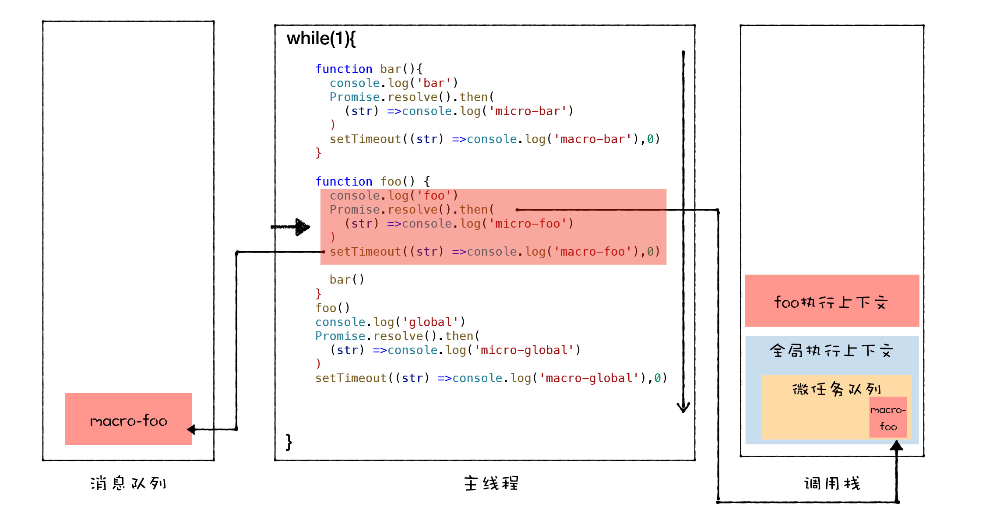  

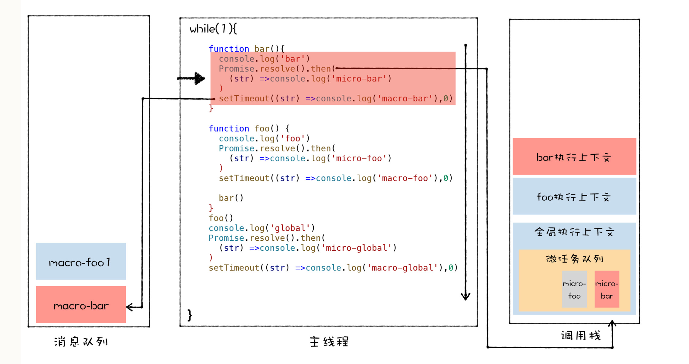  

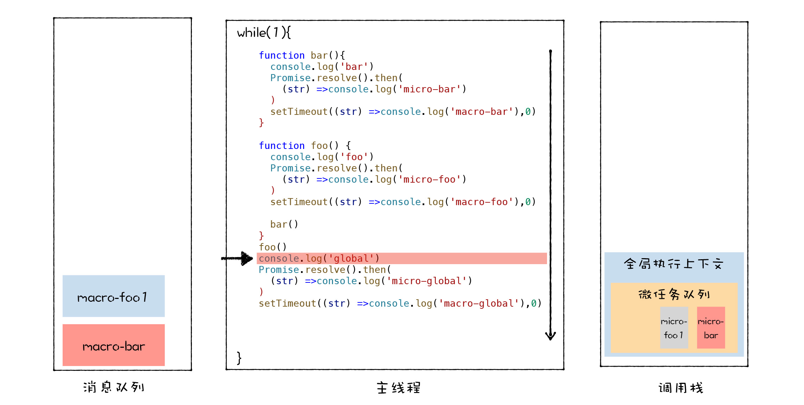  

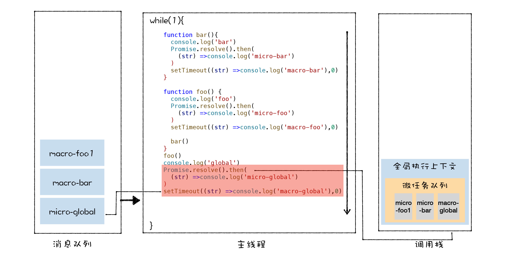  

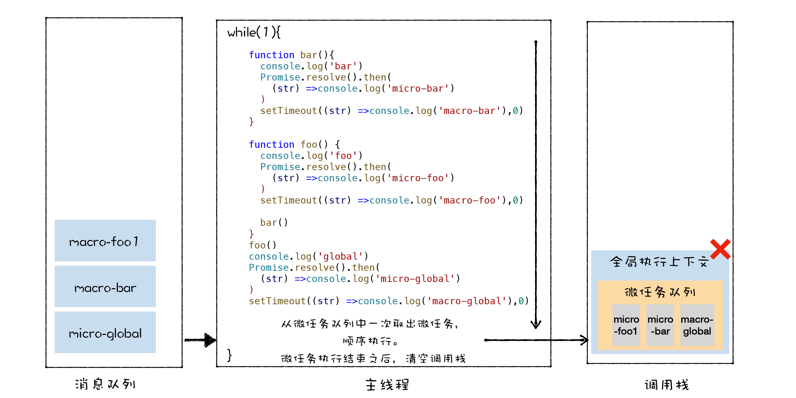  

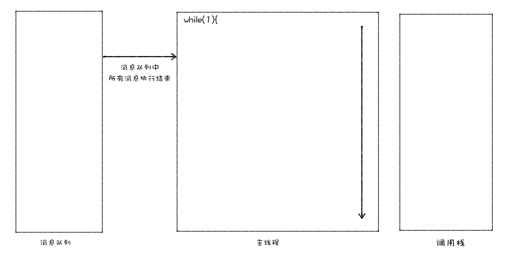