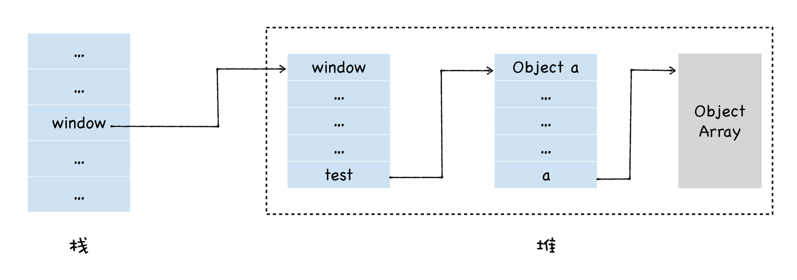
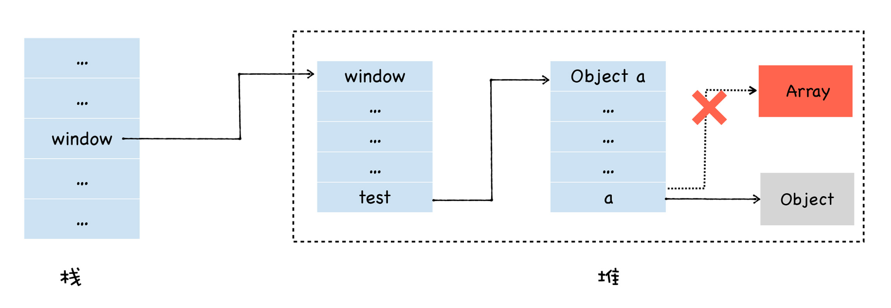
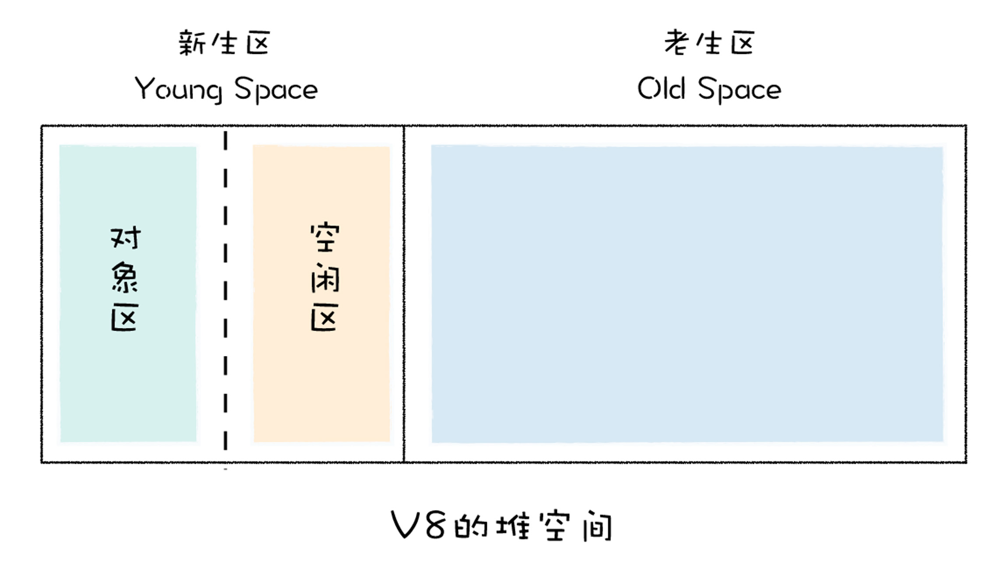
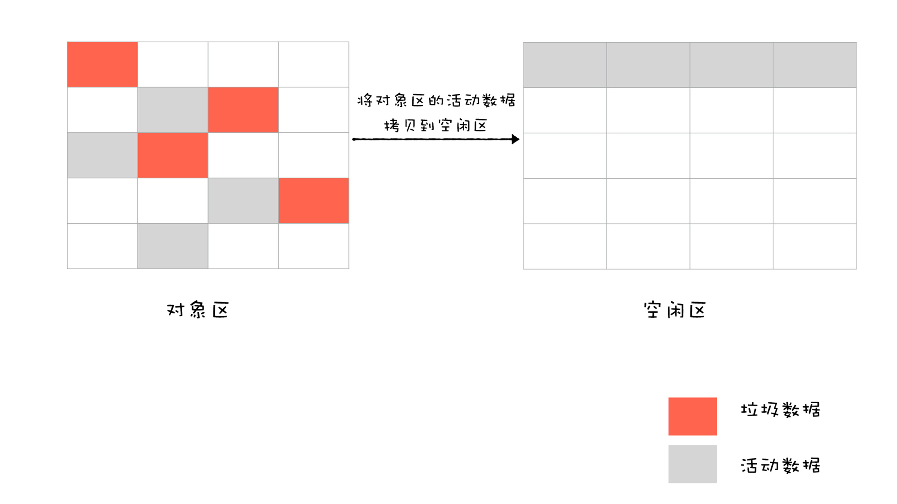
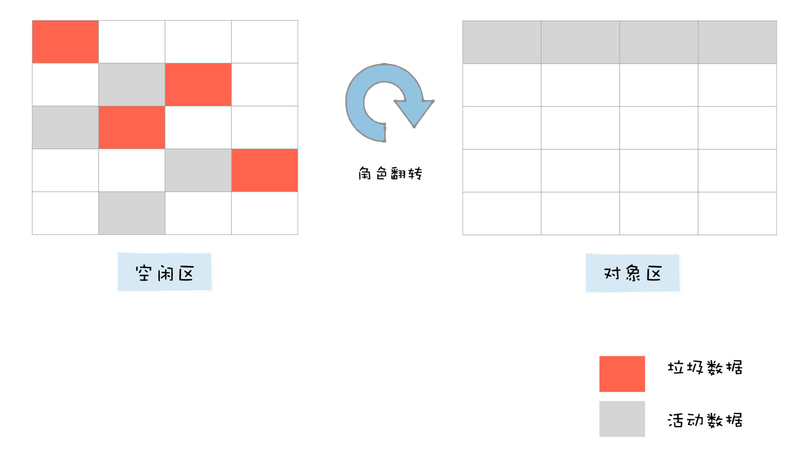
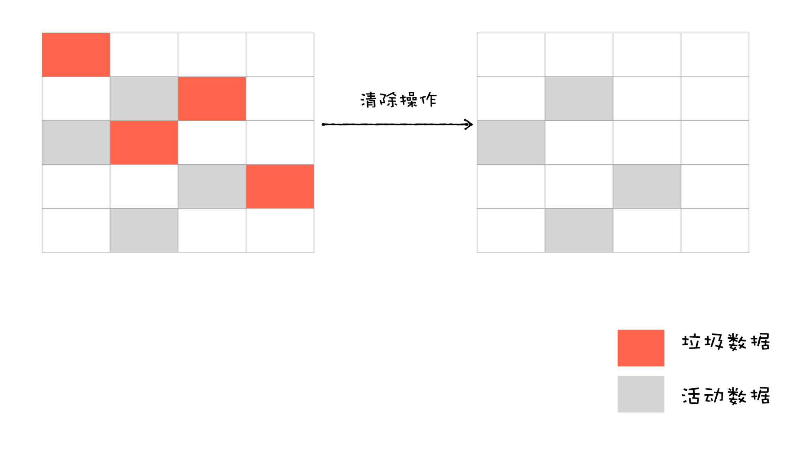
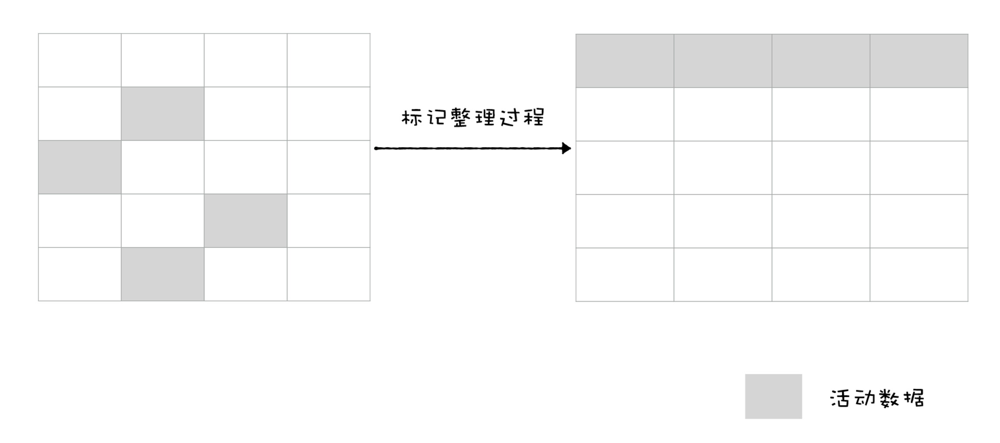

# 垃圾回收
## 垃圾数据的产生
```

window.test = new Object()
window.test.a = new Uint16Array(100)
```

  

```

window.test.a = new Object()
```



## 垃圾回收算法
1. 通过GC Root标记空间中**活动对象**和**非活动对象**
2. 回收非活动对象所占据的内存
3. 做内存整理  

### 标记
V8采用**可访问性(reachability)算法**来判断堆中的对象是否是活动对象：将一些**GC Root**作为初始存活的对象的集合，从GC Roots对象触发，遍历GC Root中的所有对象：  

- 通过GC Root遍历到的对象：可访问的(reachable) ->> 活动对象
- 没有遍历到：不可访问的(unreachable) ->> 非活动对象  


GC Root:  
- 全局的window对象(位于每个iframe中)
- 文档DOM树，由可以通过遍历文档到达的所有原生DOM节点组成
- 存放栈上变量  

### 内存整理
内存碎片：频繁回收对象后，内存中存在大量不连续空间

#### 垃圾回收器
- 主垃圾回收器-Major GC
- 副垃圾回收器-Minor GC(Scavenger)  

#### 代际假说(The Generational Hypothesis)
- 大部分对象在内存中存活的时间很多：函数内部声明的变量、块级作用域中的变量
- 长时间存在的对象：全局的window、DOM、Web API等对象  

#### 垃圾回收策略
> V8中，把**堆**分为新生代和老生代两个区域，新生代中存放的是生存时间短的对象，老生代中存放生存时间久的对象  

- 副垃圾回收器：主要负责新生代的垃圾回收
- 主垃圾回收器：负责老生代的垃圾回收  

### 副垃圾回收器
大多数小的对象都会被分配到新生代  

Scavenge算法：把新生代空间对半划分为两个区域，一半是**对象区域(from-space)**,一半是**空闲区域(to-space)**  

    

新加入对象放入对象区域，写满后，垃圾标记，清理  

  

  

角色翻转的操作能让新生代中的这两块区域**无限重复使用下去**  

把存活的对象从对象区域复制到空闲区域，复制操作需要时间成本，所以新生区空间设置较小  

### 主垃圾回收器
大的对象会直接分配到老生区中  

- 对象占用空间大
- 对象存活时间长  

#### 标记-清除(Mark-Sweep)
1. 标记过程阶段：从一组根元素开始，递归遍历这组根元素，在这个遍历过程中，能到达的元素称为活动对象，没有到达的元素就可以判断为垃圾数据
2. 垃圾的清除过程：直接将标记为垃圾的数据清理掉  

  

#### 标记-整理(Mark-Compact)
先标记可回收对象，让所有存活的对象都向一段移动，然后直接清理掉这一端之外的内存  

