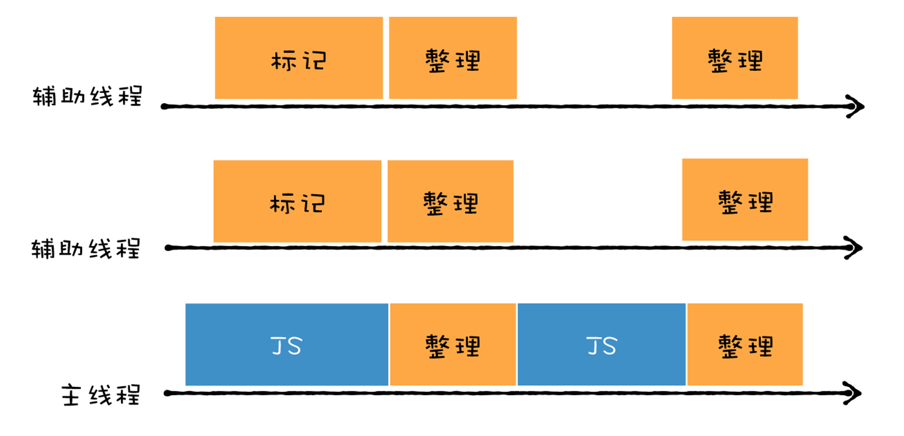

# 垃圾回收：V8是如何优化垃圾回收器执行效率的
**全停顿(Stop-The-World)**:由于JS是运行在主线程上，一旦执行垃圾回收算法，需要将正在执行的JS脚本暂停下来，待垃圾回收完毕后再恢复脚本执行  

  

解决垃圾回收效率问题  

- 将一个完整的垃圾回收的任务拆分成多个小的任务
- 将标记对象、移动对象等任务转移到后台线程进行  

## 并行回收
> 垃圾回收器在主线程上执行的过程，开启多个协助线程，同时执行同样的回收工作  

  

- V8的副垃圾回收器采用的就是并行策略  

## 增量回收
> 垃圾收集器将标记工作分解为更小的块，并且穿插在主线程不同的任务之间执行  

  

**增量回收是并发的(concurrent)**,要实现需满足两点要求  

1. 垃圾回收可以被随时暂停和重启，暂停时需要保存当时的扫描结果，等下一波垃圾回收来了之后，才能继续启动
2. 在暂停期间，被标记好的垃圾数据如果被JS代码修改了，那么垃圾回收器需要能够正确地处理  

### 暂停与恢复
- 三色标记法
- 写屏障(Write-barrier)机制  

## 并发(concurrent)回收
> 主线程在执行JS的过程中，辅助线程能够在后台完成执行垃圾回收的操作  

  

### 主垃圾回收器
同时采用以上三种策略  

  

- 首先主垃圾回收器主要使用**并发标记**，在主线程执行JS,辅助线程就开始执行标记操作，可以说标记是在辅助线程中完成的
- 标记完成后，再执行**并行清理操作**。主线程在执行清理操作时，多个辅助线程也在执行清理操作
- 主垃圾回收器采用**增量标记的方式**，清理的任务会穿插在各种JS任务之间执行