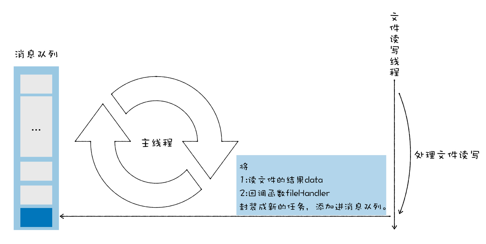

# 常见的内存问题的解决策略
## Node中的readFile API工作机制
```
var fs = require('fs);
var data = fs.readFileSync('test.js');
```

```
function fileHanlder(err, data) {
    data.toString();
}

fs.readFile('test.txt',fileHanlder)
```
Node的体系架构  

  

> Node是V8的宿主，给V8提供**事件循环**和**消息队列**。在Node中，事件循环由libuv提供，libuv工作在主线程中，它会从消息队列中取出事件，并在主线程上执行事件  

> 对于一些主线程上不适合处理的事件，比如消耗时间过久的网络资源下载、文件读写、设备访问等，Node会提供很多线程来处理这些事件，把这些线程称为**线程池**    

1. 将耗时的读写任务交给读写线程处理

    

2. 线程处理完后，封装成新事件，添加进消息队列中

    

3. 主线程从消息队列中取出事件处理

  

## 几种内存问题
- 内存泄漏(Memory leak)：导致页面的性能越来越差
- 内存膨胀(Memory bloat)：导致页面的性能一直很差
- 频繁垃圾回收：导致页面出现延迟或者经常暂停  

### 内存泄漏
> 当进程不再需要某些内存的时候，这些不再被需要的内存依然没有被进程回收  

在JS中，造成内存泄漏的主要原因是**不再需要的内存数据依然被其他对象引用着**  

```

function foo() {
    //创建一个临时的temp_array
    temp_array = new Array(200000)
   /**
    * 使用temp_array
    */
}
```
函数体内没有对象没有用var、let、const等关键字表明时，会用this对其进行绑定，而this指向window对象，window对象常驻内存，致使foo函数退出后，temp_array依旧被window引用，占用内存
```

function foo() {
    //创建一个临时的temp_array
    this.temp_array = new Array(200000)
   /**
    * this.temp_array
    */
}
```
- 闭包造成的内存泄漏
```

function foo(){  
    var temp_object = new Object()
    temp_object.x = 1
    temp_object.y = 2
    temp_object.array = new Array(200000)
    /**
    *   使用temp_object
    */
    return function(){
        console.log(temp_object.x);
    }
}
```
  

改进  

```

function foo(){  
    var temp_object = new Object()
    temp_object.x = 1
    temp_object.y = 2
    temp_object.array = new Array(200000)
    /**
    *   使用temp_object
    */
   let closure = temp_object.x
    return function(){
        console.log(closure);
    }
}
```
- JS引用DOM节点造成内存泄漏  

只有**同时满足**DOM树和JS代码都不再引用某个节点，该节点才会被作为垃圾进行回收。如果某个节点已从DOM树移除，但JS依然引用它，称为**detached**  

```

let detachedTree;
function create() {

var ul = document.createElement('ul');

for (var i = 0; i < 100; i++) {

var li = document.createElement('li');

ul.appendChild(li);

}

detachedTree = ul;

}

create() 
```

### 内存膨胀
对内存管理不科学，只需50M内存造成却花费了500M内存  

- 没有合理利用缓存
- 加载了不必要的资源  

  

### 频繁的垃圾回收
频繁使用大的临时变量，导致新生代空间很快被装满，从而频繁触发垃圾回收。频繁的垃圾回收操作导致你感觉页面卡顿  

```
function strToArray(str) {
  let i = 0
  const len = str.length
  let arr = new Uint16Array(str.length)
  for (; i < len; ++i) {
    arr[i] = str.charCodeAt(i)
  }
  return arr;
}


function foo() {
  let i = 0
  let str = 'test V8 GC'
  while (i++ < 1e5) {
    strToArray(str);
  }
}


foo()
```
